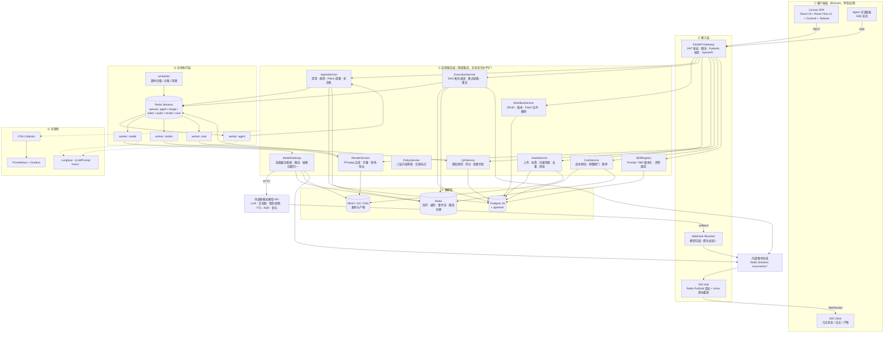
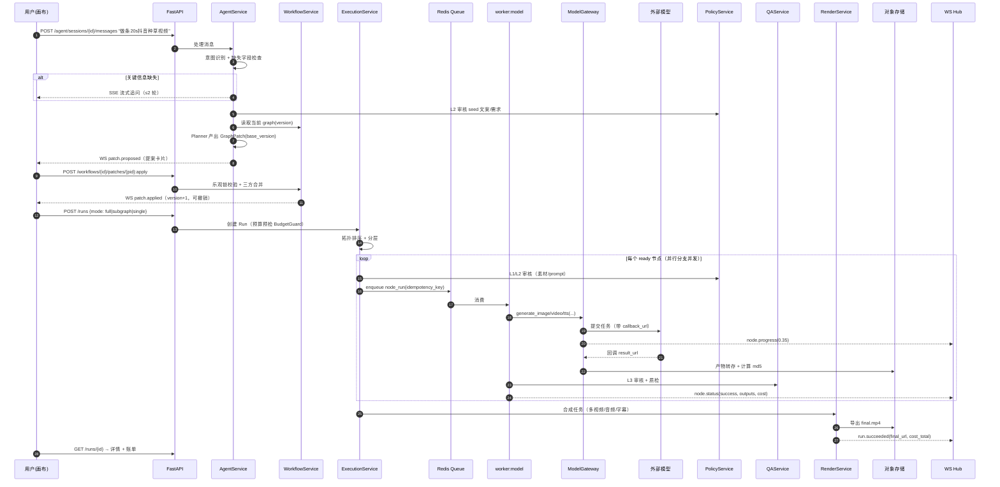
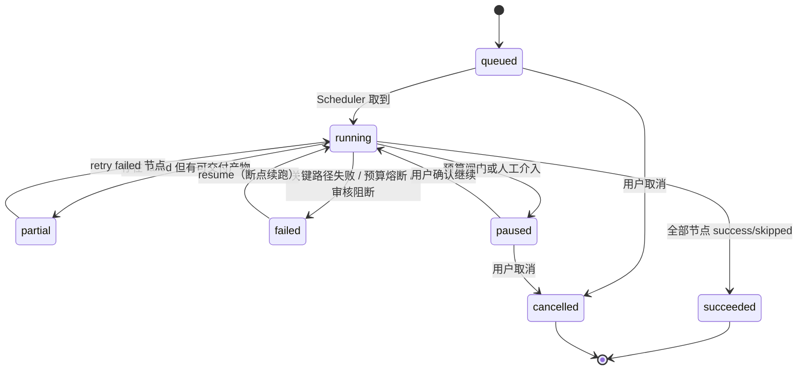
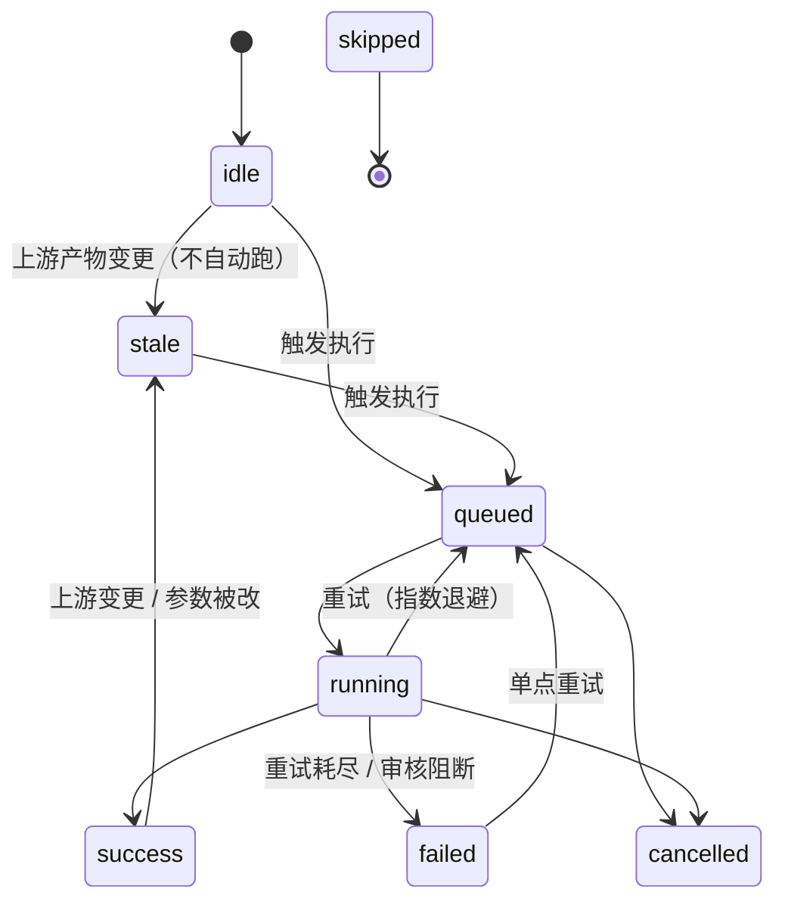
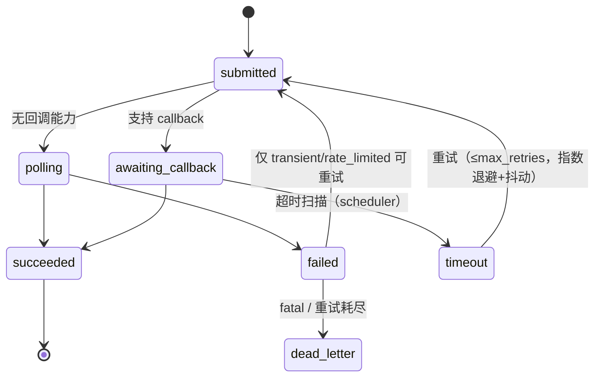
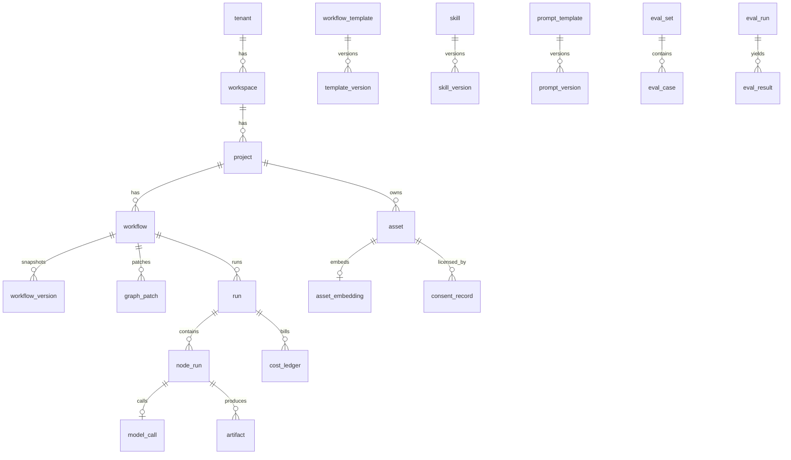

# 阶段 2：总体架构
> 项目：AI 营销视频智能体（MVA）｜上游：`docs/phase-1-requirements.md`

---

## 2.1 架构总览



**依赖方向（架构铁律）**：`CLIENT → EDGE → APP → (ASYNC | DATA)`。
APP 层内部只允许：`WFS/AGS/EXE` 依赖 `MGP/QAS/POL/CST/SKR/AST`，**反向依赖一律禁止**；所有外部模型访问必须经过 `MGP`（约束 1）。

---

## 2.2 模块职责表

| 模块 | 单一职责 | 关键类 / 函数 | 依赖 | 扩展点 |
|---|---|---|---|---|
| WorkflowService | 图的读写、版本、Patch 应用与合并、撤销 | `WorkflowRepo` `PatchApplier.apply(graph, patch)` `ThreeWayMerger` | PG | 新增 op 类型 |
| AgentService | 会话、澄清、规划、Patch 生成、Skill 调用 | `AgentRuntime` `Planner` `SkillInvoker` `PatchProposer` | WFS, SKR, MGP | 新增 Skill / 子 Agent |
| ExecutionService | 把图变成可执行计划并驱动它 | `DagBuilder.toposort()` `Scheduler.dispatch()` `RunController.retry()` | Q, PG, BUS | 新调度策略 |
| NodeExecutor（每类节点一个） | 单节点纯函数：`inputs + params -> outputs` | `BaseNodeExecutor.run(ctx)` | MGP, QAS, RND | **新增节点类型只加一个 Executor + 注册** |
| AssetService | 素材生命周期与检索 | `AssetRepo` `Embedder` `Deduper` | PG, OBJ | 新向量后端 |
| ModelGateway | 统一模型调用面 | `AdapterRegistry` `BaseImageAdapter` `BaseVideoAdapter` `BaseTTSAdapter` `BaseLLMAdapter` `RateLimiter` `RetryPolicy` | OBJ, RD | **接入新厂商 = 新增 Adapter 子类** |
| RenderService | FFmpeg 合成导出 | `TimelineBuilder` `FFmpegRunner` `SubtitleBurner` | OBJ | 新导出规格 |
| QAService | 质检规则引擎 | `QaRule`（插件式）`QaReport` | MGP(VLM), OBJ | 新规则 |
| PolicyService | 三层审核 | `PolicyGate.check(stage, payload)` | 外部审核 API | 新审核通道 |
| CostService | 预算闸门与账单 | `CostEstimator` `BudgetGuard.assert_ok()` `CostLedger` | PG | 新计价模型 |
| SkillRegistry | Prompt/Skill 版本与评测绑定 | `SkillVersionRepo` `Template.render(vars)` | PG | — |
| WS Hub | 事件扇出与断线重放 | `EventBus.publish/poll(since)` | RD | — |

---

## 2.3 端到端数据流（J1：一句话成片）



---

## 2.4 状态机

### 2.4.1 工作流 Run 状态机


### 2.4.2 节点执行状态机（含 `stale` 传播）

> `skipped` = 未选中子图、或上游失败但该节点为可选（`on_upstream_failure: skip|fail|wait`）。

### 2.4.3 模型任务状态机（每个 adapter 调用）


### 2.4.4 错误分类与重试矩阵
| 错误类 | 判定 | 重试 | 退避 | 备注 |
|---|---|---|---|---|
| `transient` | 5xx/网络/超时 | ✅ ≤3 | 2^n + jitter，封顶 60s | 幂等键保证不重复计费 |
| `rate_limited` | 429 | ✅ ≤5 | 读 `Retry-After` | 全局令牌桶降速 |
| `quota_exceeded` | 配额/余额 | ❌ | — | 自动切同能力备用 adapter |
| `content_blocked` | 审核拒绝 | ❌ | — | 直接失败 + audit_log |
| `invalid_request` | 4xx 参数 | ❌ | — | 记录 prompt hash 便于回归 |
| `fatal` | 未分类异常 | ❌ | — | 进 dead_letter，告警 |

### 2.4.5 Agent 会话状态机
`idle → clarifying → planning → proposing → (applied | rejected) → idle`，`applied` 后回到 `idle` 等待下一句；`clarifying` 最多 2 轮后强制用默认值进入 `planning`（防御死循环）。

---

## 2.5 数据库设计（Postgres 16 + pgvector）

### 2.5.1 核心表

**tenant / workspace / app_user**（MVP 单租户，结构先留）
| 表 | 关键字段 | 索引 |
|---|---|---|
| `tenant` | `id uuid pk, name, plan, created_at` | — |
| `workspace` | `id, tenant_id fk, name, brand_kit jsonb` | `(tenant_id)` |
| `app_user` | `id, tenant_id, email uk, pwd_hash, role(owner/admin/editor/viewer)` | `uk(email)` |

**project**
| 字段 | 类型 | 说明 |
|---|---|---|
| `id` | uuid pk | |
| `workspace_id` | uuid fk | |
| `name`, `goal`, `product`, `platform`, `duration_s`, `style` | text/int | 五要素 |
| `brief` | jsonb | 澄清后的 Brief |
| `created_at`, `updated_at` | timestamptz | |

**workflow**（真相源）
| 字段 | 类型 | 说明 |
|---|---|---|
| `id` | uuid pk | |
| `project_id` | uuid fk | |
| `name` | text | |
| `graph` | jsonb | `{nodes:[],edges:[],meta:{}}` |
| `version` | int | 乐观锁，每次 Patch +1 |
| `status` | text | draft/ready/running/succeeded/failed/partial/exported |
| `budget_limit_cny` | numeric(10,2) | 默认 8 |
| `spent_cny` | numeric(10,2) | 冗余累计 |
| `template_id`, `template_version` | uuid/int | 来源模板（可复现） |
| `locked_node_ids` | text[] | 冗余便于校验 |
| `created_by`, `created_at`, `updated_at` | | |
> 索引：`(project_id, updated_at desc)`；`graph` 上 GIN（`jsonb_path_ops`）用于按节点类型检索。

**workflow_version**（快照，用于回滚/评测对比）
`id, workflow_id, version, graph jsonb, patch_id, author(user|agent|template), created_at`，索引 `uk(workflow_id, version)`。

**graph_patch**（Agent/用户改动记录，可回放可撤销）
| 字段 | 说明 |
|---|---|
| `id, workflow_id, base_version, result_version` | |
| `ops` jsonb | `[{op, ...}]` |
| `rationale` text | Agent 理由 |
| `author` text | user/agent/template |
| `status` text | proposed/applied/rejected/partially_applied |
| `conflict` jsonb | 三方合并冲突详情（保留用户值） |
| `created_at` | |
> 索引：`(workflow_id, result_version)`、`(status)`。

**run**（工作流一次执行）
`id, workflow_id, workflow_version, mode(full|subgraph|single), selected_node_ids text[], status, budget_limit_cny, spent_cny, started_at, finished_at, final_artifact_id, error jsonb, trace_id`；索引 `(workflow_id, created_at desc)`、`(status)`。

**node_run**（最小可恢复单元 = 断点续跑检查点）
| 字段 | 说明 |
|---|---|
| `id, run_id, node_id, node_type, attempt` | |
| `status` | queued/running/success/failed/skipped/cancelled |
| `idempotency_key` | `sha256(run_id:node_id:input_hash:attempt_policy)` **唯一索引** |
| `input_hash` | 上游产物 md5 + params hash |
| `inputs` jsonb / `outputs` jsonb | 端口数据快照 |
| `resolved_params` jsonb | 变量注入 + prompt 版本号 |
| `model_call_id` | 关联模型调用 |
| `cost_cny`, `latency_ms` | |
| `error` jsonb, `log_ref` | |
| `started_at`, `finished_at` | |
> 索引：`uk(idempotency_key)`、`(run_id, node_id, attempt desc)`。

**model_call**（模型调用流水）
`id, node_run_id, adapter, model, capability(image|video|tts|asr|llm|music), request jsonb, external_task_id, status, prompt_tokens, completion_tokens, unit, qty, cost_cny, latency_ms, retry_count, raw_response_ref, created_at`；索引 `(adapter, model, created_at)`、`(external_task_id)`。

**artifact**（产物统一表）
`id, run_id, node_id, node_run_id, kind(image|video|audio|text|report|final), storage_key, mime, width, height, duration_ms, size_bytes, md5, meta jsonb, created_at`；索引 `(run_id, node_id)`、`uk(storage_key)`。

**asset**（用户素材 / 生成素材归库）
`id, workspace_id, project_id, kind, storage_key, mime, md5 uk, source(upload|generated), tags text[], portrait bool, license_status, usage_count, created_at`；索引 `(workspace_id, kind)`、`GIN(tags)`、`uk(md5, workspace_id)` 去重。

**asset_embedding**（向量检索）
`asset_id pk fk, embedding vector(1024), model, updated_at`；索引 `ivfflat (embedding vector_cosine_ops)`。

**consent_record**（版权/肖像留痕）
`id, asset_id fk, subject_type(真人|品牌|第三方), license_scope, allowed_platforms text[], expires_at, evidence_ref, declared_by, created_at`。

**cost_ledger**（账单）
`id, workspace_id, project_id, workflow_id, run_id, node_run_id, adapter, model, unit, qty, cost_cny, created_at`；索引 `(workspace_id, created_at)` 用于日/月汇总。

**audit_log**（审核与合规）
`id, workflow_id, run_id, node_id, stage(L1|L2|L3), verdict(pass|block|review), categories text[], provider, score, raw_ref, action, actor, created_at`；索引 `(verdict, created_at)`、`(run_id)`。

**agent_session / agent_message**
`agent_session(id, project_id, workflow_id, state, context jsonb, created_at)`；
`agent_message(id, session_id, role, content, tool_calls jsonb, tokens, cost_cny, created_at)`。

**skill / skill_version / prompt_template / prompt_version**
`skill(id, key uk, name, kind(agent_skill|node_prompt), owner, created_at)`；
`skill_version(id, skill_id, version, manifest jsonb, io_schema jsonb, created_at)` uk(skill_id,version)；
`prompt_template(id, key, purpose, created_at)`；`prompt_version(id, template_id, version, body, variables jsonb, model_hint, status(draft|active|archived), eval_score, created_at)` uk(template_id,version)。

**workflow_template / template_version**
`workflow_template(id, workspace_id, name, category, is_public, created_at)`；
`template_version(id, template_id, version, graph jsonb, variables jsonb, brand_kit jsonb, changelog, created_at)` uk(template_id,version)。

**eval_set / eval_case / eval_run / eval_result**
`eval_set(id, workspace_id, name)`；`eval_case(id, eval_set_id, brief jsonb, assets uuid[], expected jsonb, tags)`；
`eval_run(id, eval_set_id, prompt_version_ids uuid[], workflow_template_id, status, metrics jsonb, cost_cny, created_at)`；
`eval_result(id, eval_run_id, case_id, output jsonb, scores jsonb, pass bool)`。

**job_outbox**（事务性发件箱，保证「DB 提交 → 入队」不丢）
`id, kind, payload jsonb, status(pending|sent|failed), attempts, next_retry_at, created_at`；索引 `(status, next_retry_at)`。

**idempotency_key**（HTTP 层幂等）
`key uk, endpoint, request_hash, response jsonb, created_at`。

### 2.5.2 关系概览


---

## 2.6 API 清单（REST `/api/v1`）

### 2.6.1 项目 / 素材
| 方法 | 路径 | 说明 |
|---|---|---|
| POST | `/projects` | 建项目（含五要素 + brief） |
| GET | `/projects/{id}` | 详情（含工作流列表、花费汇总） |
| POST | `/assets/upload-url` | 取预签名上传 URL（`filename, mime, kind` → `{url, storage_key}`） |
| POST | `/assets` | 登记素材（`storage_key, tags, portrait, consent{...}`）→ 触发 embedding + 去重 |
| GET | `/assets` | 列表（`?tags=&kind=&portrait=&q=`） |
| GET | `/assets/search` | 向量检索（`?text=&top_k=&min_score=`） |
| POST | `/assets/{id}/consent` | 追加授权记录 |

### 2.6.2 工作流 / Patch / 模板
| 方法 | 路径 | 说明 |
|---|---|---|
| POST | `/workflows` | 新建（可带 `template_id` 实例化） |
| GET | `/workflows/{id}` | 取 `{graph, version, status, budget}` |
| PATCH | `/workflows/{id}` | 元信息更新（name/budget_limit_cny） |
| GET | `/workflows/{id}/versions` | 版本列表 |
| POST | `/workflows/{id}/versions/{v}/restore` | 回滚（生成新版本） |
| POST | `/workflows/{id}/patches` | 提交 Patch（用户或 Agent）→ `{patch_id, status}` |
| POST | `/workflows/{id}/patches/{pid}:apply` | 应用提案 |
| POST | `/workflows/{id}/patches/{pid}:reject` | 拒绝提案 |
| POST | `/workflows/{id}/undo` | 撤销最近一次 Patch（`{patch_id?}`） |
| POST | `/workflows/{id}/validate` | DSL 校验（类型/端口/环/必填） |
| POST | `/workflows/{id}/export` | 导出 JSON |
| POST | `/workflows/import` | 导入 JSON（校验 + 生成新 id） |
| GET/POST | `/templates` | 模板库列表 / 从选中节点组创建模板 |
| GET | `/templates/{id}/versions` | 模板版本 |
| POST | `/templates/{id}/instantiate` | 在画布实例化（`{variables}`） |

### 2.6.3 执行
| 方法 | 路径 | 说明 |
|---|---|---|
| POST | `/runs` | 创建执行：`{workflow_id, mode, node_ids?[], budget_limit_cny?, force?}` → `{run_id}` |
| GET | `/runs/{id}` | 状态 + 节点状态聚合 + 花费 |
| GET | `/runs/{id}/nodes` | 节点级明细（输入/输出/耗时/成本/错误） |
| POST | `/runs/{id}/cancel` | 取消（优雅：不再取新任务，running 等待回调或超时） |
| POST | `/runs/{id}/resume` | 断点续跑 |
| POST | `/runs/{id}/nodes/{node_id}/retry` | 单点重试（`{force: bool}` 忽略幂等缓存） |
| GET | `/runs/{id}/estimate` | 成本与时长预估（不执行） |
| GET | `/runs/{id}/logs` | 节点日志（分页 / `?node_id=`） |
| POST | `/webhooks/models/{adapter}` | 模型回调入口（签名校验 + 去重） |

### 2.6.4 Agent / 模型 / 质检 / 成本 / 评测
| 方法 | 路径 | 说明 |
|---|---|---|
| POST | `/agent/sessions` | 建会话（绑定 project + workflow） |
| POST | `/agent/sessions/{id}/messages` | 发消息（返回 `{reply, patch_id?, questions?}`） |
| GET | `/agent/sessions/{id}/stream` | **SSE** 流式回复 + 工具调用轨迹 |
| GET | `/models` | 可用模型及能力：`{capability, adapter, model, price_unit, price, max_duration, supports_callback, limits}` |
| POST | `/models/estimate` | 预估成本（`{node_type, params, adapter?}`） |
| GET | `/runs/{id}/qa-report` | 质检报告 |
| POST | `/qa/recheck` | 对指定产物重跑质检规则子集 |
| GET | `/costs/summary` | 成本汇总（`?from=&to=&group_by=workflow|model|day`） |
| GET | `/skills` / `/skills/{key}/versions` | Skill 与版本 |
| GET | `/prompts/{key}/versions` | Prompt 版本 |
| POST | `/evals/runs` | 启动评测（`{eval_set_id, prompt_version_ids[]}`） |
| GET | `/evals/runs/{id}` | 评测结果与指标 |
| GET | `/healthz` / `/readyz` / `/metrics` | 探针 + Prometheus |

### 2.6.5 关键请求/响应示例
```jsonc
// POST /api/v1/runs
{ "workflow_id": "wf_01H...", "mode": "subgraph",
  "node_ids": ["n_1","n_2","n_3"], "budget_limit_cny": 5.0 }
// 201
{ "run_id": "run_01H...", "status": "queued",
  "estimate": { "cost_cny": 3.2, "eta_s": 240 }, "created_at": "..." }

// GET /api/v1/runs/{id}
{ "run_id": "run_01H...", "workflow_id": "wf_01H...", "status": "running",
  "progress": { "total": 12, "success": 7, "running": 2, "failed": 1, "skipped": 2 },
  "spent_cny": 1.83, "nodes": [
    { "node_id": "n_3", "type": "image", "status": "failed", "attempt": 3,
      "error": { "class": "content_blocked", "message": "prompt 命中敏感词", "retryable": false },
      "cost_cny": 0.06, "latency_ms": 8123 } ],
  "final_artifact": null }
```

---

## 2.7 实时通道协议（WebSocket / SSE）

**连接**：`wss://host/ws/workflows/{workflow_id}?token=JWT&since={event_seq}`
**事件信封**（所有推送统一格式）：
```jsonc
{ "event_id": "evt_01H...", "seq": 10231, "ts": "2026-01-01T10:00:00Z",
  "workflow_id": "wf_...", "run_id": "run_...", "trace_id": "...",
  "type": "node.status", "payload": { } }
```
| type | payload 关键字段 |
|---|---|
| `run.status` | `status, progress, spent_cny, final_artifact` |
| `node.status` | `node_id, status, attempt, outputs_digest, cost_cny, latency_ms` |
| `node.progress` | `node_id, pct, stage(queued|submitted|polling|downloading)` |
| `node.artifact` | `node_id, artifact{id, kind, url, thumb_url, w, h, duration_ms}` |
| `node.log` | `node_id, level, message` |
| `patch.proposed` | `patch_id, ops, rationale, conflicts[], requires_approval` |
| `patch.applied` | `patch_id, version, op_count, undoTip` |
| `cost.warning` | `spent_cny, limit_cny, pct` |
| `policy.blocked` | `stage, categories[], node_id, message, appealable` |
| `graph.updated` | `version, changed{added[],updated[],removed[]}`（多人/多端同步） |

**断线重放**：事件写入 Redis Stream `mva.events.{workflow_id}`（`MAXLEN ~ 10000`），客户端带 `since` 重连 → 服务端 `XRANGE` 补发，保证「不丢状态」。心跳 `ping/pong` 25s。
**SSE 仅用于 Agent 对话流**（token 级输出 + 工具轨迹），不复用 WS。

---

## 2.8 横切设计要点

| 关注点 | 方案 |
|---|---|
| 幂等 | `node_run.idempotency_key = sha256(run_id:node_id:input_hash)` 唯一约束；重复入队直接返回已有结果；HTTP 层 `Idempotency-Key` 头 |
| 断点续跑 | `node_run` 即检查点；`resume` 只执行 `status ∈ {failed, queued} ∪ stale` 的节点；`input_hash` 未变则复用产物（成本 0） |
| 队列与限流 | Redis Streams + 消费组；按 adapter 维护令牌桶（`rate:{adapter}`），并发信号量 `sem:{adapter}`；重任务（video）独立队列防饿死短任务 |
| 存储规范 | `s3://{bucket}/{tenant}/{project}/{workflow}/{run}/{node}/{kind}_v{n}.{ext}`；素材 `.../assets/{workspace}/{yyyy}/{mm}/{md5}.{ext}`；产物 URL 一律发预签名（TTL 1h） |
| 版本管理 | Prompt/Skill/Template 全部 `key + version` 三元组；`node_run.resolved_params` 记录实际使用的版本，保证可复现 |
| 安全 | JWT（access 30min / refresh 7d）；对象存储仅经预签名；上传做 MIME 嗅探 + 大小限制；回调做 HMAC 签名 + 时间戳防重放 |
| 事务边界 | 「写 DB + 入队」用 `job_outbox` 事务性发件箱，scheduler 兜底投递 |
| 可观测 | 全链路 `trace_id`（run_id 贯穿）；每个 adapter 调用打点 `latency/cost/retry`；Langfuse 记录 prompt 版本与输出 |
| 降级 | 同能力多 adapter 优先级链；主 adapter 失败/限流 → 自动切备用（成本变化写 ledger 并提示用户） |

---

## 2.9 端口与组件（MVP 单机 Docker Compose）
| 服务 | 镜像/运行时 | 端口 |
|---|---|---|
| web | node:20 + vite preview / nginx | 5173 / 80 |
| api | python:3.12 + uvicorn | 8000 |
| worker | python:3.12 + arq | — |
| postgres | pgvector/pgvector:pg16 | 5432 |
| redis | redis:7-alpine | 6379 |
| minio | minio/minio | 9000 / 9001 |
| otel-collector + prometheus + grafana | — | 4317 / 9090 / 3000 |

**下一步**：确认后进入 **阶段 3：Agent 设计**（主/子 Agent、工具与 Skill 定义、JSON Schema、Prompt 模板、状态转换、重试与幂等策略）。
