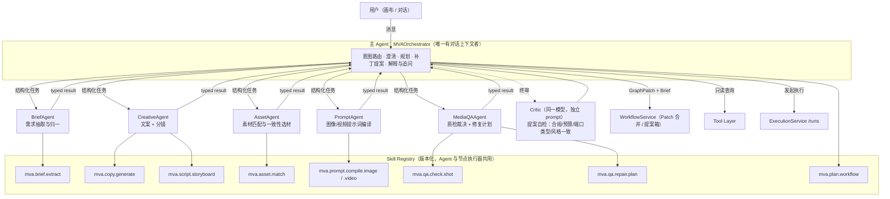
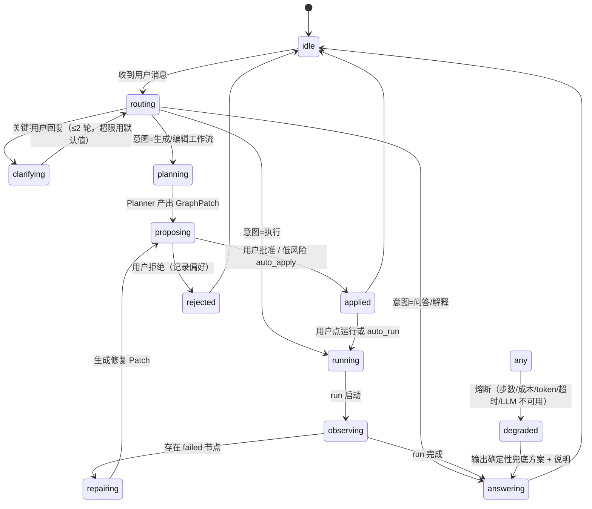
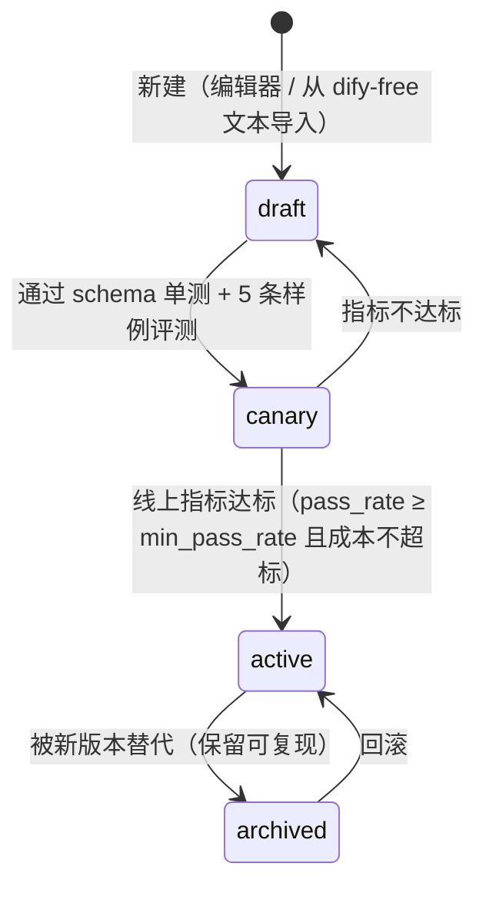
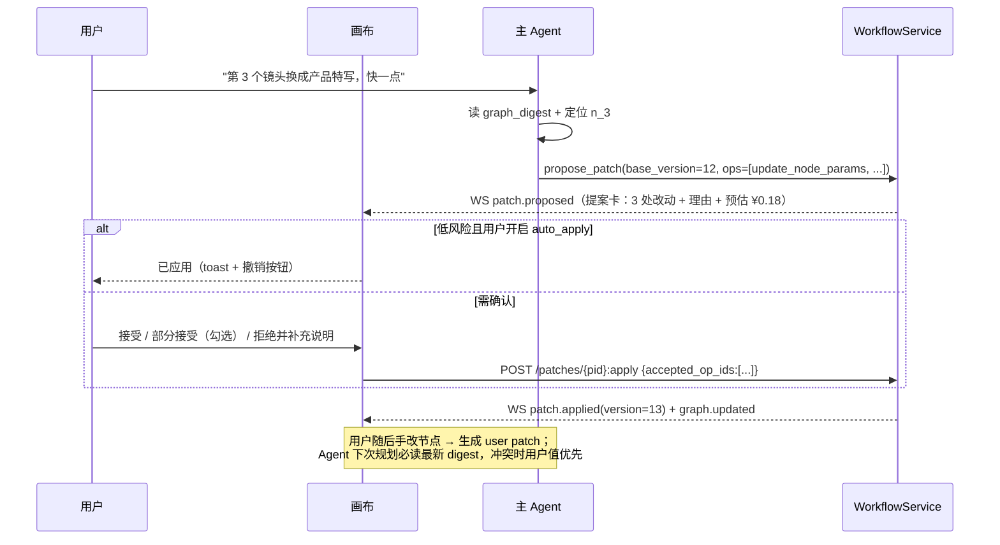

# 阶段 3：Agent 设计
> 项目：AI 营销视频智能体（MVA）｜上游：`docs/phase-1-requirements.md`、`docs/phase-2-architecture.md`

---

## 3.0 设计原则（先立规矩）

| # | 原则 | 理由 |
|---|---|---|
| P1 | **Agent 只产出「Brief + GraphPatch + 解释」，不产出视频** | 重活交给 ExecutionService/NodeExecutor，Agent 才不会变成瓶颈与不可控成本源 |
| P2 | **Skill 是唯一能力单元**，Agent 与节点执行器**共用同一份 Skill** | 保证「用户手动编排」与「Agent 自动生成」结果同源同质（约束 10） |
| P3 | **子 Agent 不共享对话上下文**，只收结构化输入、只回结构化输出 | 省 token、可单测、可缓存、可并行 |
| P4 | **写操作默认提案化**，按风险分级决定 auto-apply | 人机协同安全（阶段 1 §4.4 权限矩阵落地） |
| P5 | **一切结构化输出必须过 Pydantic 校验**，失败走「修复重试」而非重试 | LLM 输出不稳定是常态，靠 schema + repair 收敛 |
| P6 | **循环/成本/步数三重熔断**，且有确定性兜底路径 | Agent 挂了也要能出片（降级为模板流水线） |

---

## 3.1 Agent 拓扑



### 子 Agent 职责与边界

| 子 Agent | 优先级 | 输入（结构化） | 输出（结构化） | 不做什么 |
|---|---|---|---|---|
| `MVAOrchestrator`（主） | P0 | 用户消息 + 会话上下文 + 图摘要 | 对话回复 / `GraphPatch` / `RunRequest` | 不直接调模型生成内容，不写 DB |
| `BriefAgent` | P0 | 原始需求文本 + 上传素材摘要 | `Brief` | 不编造不存在的产品信息（缺失即留空 + 追问） |
| `CreativeAgent` | P0 | `Brief` | `CopySet` + `Storyboard` | 不做素材选择、不写 prompt 技术参数 |
| `PromptAgent` | P0 | `Storyboard.shot` + `Brief.style` + 目标模型族 | `CompiledPrompt`（正向/负向/参数建议） | 不改分镜结构 |
| `AssetAgent` | P1 | shot 描述 + 素材库检索结果 | `AssetSelection[]`（含命中理由与替代项） | 不使用未授权真人素材（硬校验） |
| `MediaQAAgent` | P0 | `QaReport`（规则引擎产出）+ 产物元数据 | `RepairPlan`（→ 转 Patch 或重跑指令） | 不直接改图/改视频 |
| `Critic` | P0 | 待应用 `GraphPatch` + 图上下文 | `{ok, violations[], severity}` | 只否决/降级，不新增内容 |

---

## 3.2 Agent 间消息协议

```jsonc
// AgentTask（主 → 子）
{
  "task_id": "t_01H...",
  "agent": "CreativeAgent",
  "skill": { "key": "mva.script.storyboard", "version": "1.3.0" },
  "input": { /* 严格符合 skill.input_schema */ },
  "constraints": { "max_tokens": 4000, "cost_budget_cny": 0.12, "timeout_s": 60,
                   "forbidden": ["编造价格", "使用未授权真人素材"] },
  "trace": { "session_id": "as_...", "workflow_id": "wf_...", "run_id": null, "parent_task_id": null }
}

// AgentResult（子 → 主）
{
  "task_id": "t_01H...",
  "status": "ok | schema_error | budget_exceeded | timeout | policy_blocked | error",
  "output": { /* 符合 skill.output_schema */ },
  "meta": { "skill_key": "...", "skill_version": "1.3.0", "model": "qwen-max",
            "tokens": { "in": 1820, "out": 940 }, "cost_cny": 0.031,
            "latency_ms": 4210, "schema_repairs": 1, "attempt": 1 },
  "citations": [ { "type": "asset", "id": "as_7" }, { "type": "brief_field", "path": "usp[0]" } ]
}
```
> `citations` 让主 Agent 能向用户解释「这句卖点来自你上传的素材/需求」，并支撑质检的文案准确性判定。

---

## 3.3 Skill 规范（可复用 / 可测试 / 可版本管理）

### 3.3.1 Skill 清单（P0 = MVP）

| key | 优先级 | 节点类型复用 | 模型能力 | 版本策略 | 关键输出 |
|---|---|---|---|---|---|
| `mva.brief.extract` | P0 | — | llm | v1.x | `Brief` |
| `mva.copy.generate` | P0 | `text` | llm | v1.x | `CopySet{variants[3]}` |
| `mva.script.storyboard` | P0 | `script` | llm | v1.x | `Storyboard{shots[]}` |
| `mva.plan.workflow` | P0 | — | llm | v1.x | `GraphPatch` |
| `mva.prompt.compile.image` | P0 | `prompt_compile` | llm | v1.x | `CompiledPrompt` |
| `mva.prompt.compile.video` | P0 | `prompt_compile` | llm | v1.x | `CompiledPrompt` |
| `mva.qa.check.shot` | P0 | `qa_check` | vlm + rules | v1.x | `ShotQaReport` |
| `mva.qa.repair.plan` | P0 | — | llm | v1.x | `RepairPlan` |
| `mva.asset.match` | P1 | — | embedding + llm | v1.x | `AssetSelection[]` |
| `mva.voice.script` | P1 | `audio` | llm | v1.x | `VoiceScript{segments[]}` |

### 3.3.2 Skill 目录结构与 Manifest

```
skills/
└── mva.copy.generate/
    ├── 1.2.0/
    │   ├── manifest.yaml
    │   ├── prompt.jinja
    │   ├── input.schema.json
    │   ├── output.schema.json
    │   ├── examples/{in_01.json,out_01.json}     # few-shot + 单测用例同源
    │   └── tests/test_skill.py
    └── 1.3.0/ ...
```

```yaml
# manifest.yaml
key: mva.copy.generate
version: 1.3.0
kind: agent_skill            # agent_skill | node_prompt
node_types: [text]           # 可被哪些节点执行器复用
description: 依据 Brief 生成多版本营销短视频文案（hook/正文/CTA）
input_schema: input.schema.json
output_schema: output.schema.json
prompt_template: prompt.jinja
model_hint:
  capability: llm
  prefer: [deepseek-chat, qwen-max, gpt-4o-mini]   # 优先级链，非硬编码
  temperature: 0.8
  max_tokens: 2048
  json_mode: true
io_examples: examples/
guards:
  max_cost_cny: 0.15
  timeout_s: 60
  schema_repair_retries: 2
eval:
  set: mva_copy_v1
  min_pass_rate: 0.85        # 低于此值 CI 拒绝激活该版本
status: active
```

### 3.3.3 Skill 注册与调用（伪代码）

```python
class SkillRegistry:
    def resolve(self, key: str, version: str | None = None) -> SkillSpec:
        """version=None → 取该 key 的 active 版本（灰度时按 session_id hash 分流）"""

class SkillRunner:
    async def run(self, spec: SkillSpec, inputs: dict, constraints: Constraints) -> AgentResult:
        validate(inputs, spec.input_schema)                    # 入参校验
        vars = build_vars(inputs)                              # 变量注入
        prompt = spec.template.render(vars)                    # 版本化模板
        for attempt in range(1 + spec.guards.schema_repair_retries + 1):
            raw = await llm_gateway.complete(prompt, spec.model_hint, constraints)
            try:
                out = validate_json(raw, spec.output_schema)   # 严格校验
                return AgentResult(status="ok", output=out, meta=...)
            except SchemaError as e:
                if attempt == spec.guards.schema_repair_retries:
                    return AgentResult(status="schema_error", ...)
                prompt = repair_prompt(prompt, raw, e)         # 携带错误信息修复
        # 永不无脑重试：修复重试≠重试
```

---

## 3.4 工具层（Agent 可调用的函数）

### 3.4.1 工具清单与风险分级

| 工具 | 读/写 | 风险级 | 说明 |
|---|---|---|---|
| `get_workflow_graph(workflow_id)` | 读 | safe | 返回图摘要（非全量 JSON） |
| `get_graph_digest(workflow_id)` | 读 | safe | 每节点一行 DSL，供规划用 |
| `list_assets(kind?, tags?, limit)` / `search_assets(text, top_k)` | 读 | safe | 素材检索 |
| `get_asset_detail(asset_id)` | 读 | safe | 含 `portrait`、`consent` 状态 |
| `list_models(capability)` | 读 | safe | 能力/价格/时长上限 |
| `estimate_cost(node_type, params, adapter?)` | 读 | safe | 预算预检 |
| `get_run_status(run_id)` / `get_node_run(run_id, node_id)` | 读 | safe | 执行态查询 |
| `get_qa_report(run_id)` | 读 | safe | 质检报告 |
| `describe_artifact(artifact_id)` | 读 | safe | VLM 描述产物（用于质检与解释） |
| `check_policy(stage, payload)` | 读 | safe | 审核预检 |
| `propose_patch(ops, rationale)` | 写 | **confirm** | 默认进提案箱 |
| `apply_patch(patch_id)` | 写 | **confirm** | 需用户批准或 `auto_apply` 授权 |
| `run_workflow(mode, node_ids?, budget?)` | 写 | **confirm** | 触发真实花费 |
| `retry_node(run_id, node_id, force?)` | 写 | **confirm** | 可产生新花费 |
| `create_template(name, node_ids, variables)` | 写 | **confirm** | 结构变更 |
| `tag_asset(asset_id, tags)` | 写 | safe→auto | 低风险，可自动 |
| `request_user_confirmation(question, options)` | 交互 | safe | 澄清/审批 |
| `delete_workflow` / `publish_template` / `unlock_node` | 写 | **forbidden** | Agent 永不允许（阶段 1 §4.4） |

### 3.4.2 工具 Schema 示例

```jsonc
// search_assets
{ "name": "search_assets",
  "parameters": { "type": "object", "additionalProperties": false,
    "properties": {
      "text": { "type": "string", "description": "画面描述，如 '冰镇气泡水特写'" },
      "kind": { "enum": ["image", "video", "audio"] },
      "top_k": { "type": "integer", "minimum": 1, "maximum": 20, "default": 5 },
      "min_score": { "type": "number", "default": 0.62 },
      "allow_portrait": { "type": "boolean", "default": false,
        "description": "是否允许使用真人素材；仅当对应 asset 有有效 consent 时生效" } },
    "required": ["text"] } }

// propose_patch
{ "name": "propose_patch",
  "parameters": { "type": "object", "additionalProperties": false,
    "properties": {
      "base_version": { "type": "integer" },
      "rationale": { "type": "string", "maxLength": 300 },
      "ops": { "type": "array", "minItems": 1, "maxItems": 40,
               "items": { "$ref": "#/$defs/PatchOp" } } },
    "required": ["base_version", "rationale", "ops"] } }

// run_workflow
{ "name": "run_workflow",
  "parameters": { "type": "object", "additionalProperties": false,
    "properties": {
      "mode": { "enum": ["full", "subgraph", "single"] },
      "node_ids": { "type": "array", "items": { "type": "string" } },
      "budget_limit_cny": { "type": "number", "minimum": 0.1, "maximum": 50 } },
    "required": ["mode"] } }
```

---

## 3.5 主 Agent 循环（含状态机）

### 3.5.1 状态机


**转移表（含守卫条件与动作）**

| From → To | 守卫（Guard） | 动作（Action） |
|---|---|---|
| idle → routing | 收到消息 | 装配上下文（预算化）；`classify_intent` |
| routing → clarifying | `Brief` 必填项缺失且 `clarify_rounds < 2` | 生成 1–3 个**带选项的**问题（SSE 流式） |
| routing → planning | 意图 ∈ {生成, 编辑, 打组, 换风格} | `mva.plan.workflow` |
| routing → running | 意图 = 执行 | `check_budget` → `run_workflow` |
| planning → proposing | 产出合法 `GraphPatch` 且 `Critic.ok` | `propose_patch`；风险分级决定 auto-apply |
| proposing → applied | `user_approved` ∨ (`auto_apply` ∧ risk=low ∧ 无冲突) | `apply_patch`；推送 `patch.applied` |
| proposing → rejected | 用户拒绝 | 记 `agent_message.feedback`，供偏好学习 |
| applied → running | `auto_run=true` ∧ `BudgetGuard.ok` | 创建 run |
| observing → repairing | `failed_nodes > 0` ∧ `repair_attempts < 2` | `mva.qa.repair.plan` → 新 Patch |
| any → degraded | 步数 > 12 ∨ 成本 > 预算 ∨ token > 60k ∨ 单步 > 60s ∨ LLM 全链失败 | 走 §3.8 兜底 |

### 3.5.2 主循环伪代码

```python
MAX_STEPS, MAX_TOOL_CALLS = 12, 20
AGENT_COST_BUDGET_CNY = 0.5          # 每轮对话
AGENT_TOKEN_BUDGET = 60_000

async def handle_message(session: AgentSession, user_msg: str) -> Reply:
    ctx = await assemble_context(session, user_msg)      # §3.6
    state, budget = "routing", Budget(AGENT_COST_BUDGET_CNY, AGENT_TOKEN_BUDGET)

    for step in range(MAX_STEPS):
        if budget.exhausted(): return await degrade(session, "budget_exhausted")

        intent = await classify_intent(user_msg, ctx)     # 轻量模型，1 次调用
        match intent:
            case "clarify" | "plan":
                brief = await run_skill("mva.brief.extract", ctx.raw_input)
                if missing_required(brief) and session.clarify_rounds < 2:
                    session.clarify_rounds += 1
                    return ask(session, questions_for(brief))       # 带选项，最多 3 问

                # 子 Agent 并行（无共享上下文）
                creative, assets = await asyncio.gather(
                    run_agent("CreativeAgent", brief),
                    run_agent("AssetAgent", brief, ctx.asset_hits),
                )
                prompts = await run_agent("PromptAgent", creative, brief.style, ctx.target_model_family)

                patch = await run_skill("mva.plan.workflow",
                                        brief=brief, creative=creative,
                                        assets=assets, prompts=prompts,
                                        graph_digest=ctx.graph_digest,      # 增量编辑的关键
                                        node_catalog=NODE_CATALOG,          # 可用节点与端口
                                        locked_node_ids=ctx.locked)

                verdict = await critic_review(patch, ctx)                   # 自检
                if not verdict.ok and verdict.severity == "high":
                    patch = await run_skill("mva.plan.workflow", **retry_kwargs(patch, verdict))

                risk = classify_risk(patch, ctx)                            # §3.7
                if ctx.policy_blocked(patch):  return await explain_block(patch)
                if not budget.allow(estimate_cost(patch)): return await suggest_cheaper(patch)

                pid = await propose_patch(session.workflow_id, patch, risk)
                if risk == "low" and session.auto_apply:
                    await apply_patch(pid); return reply("已生成并应用工作流（Cmd+Z 可撤销）", pid)
                return reply("我生成了这套流程，请确认", pid)

            case "run":
                if not await check_budget(session.workflow_id): return await ask_budget(...)
                run_id = await run_workflow(session.workflow_id, mode="full")
                return reply("开始生成，画布上可实时看到进度", run_id=run_id)

            case "observe_repair":
                rep = await run_skill("mva.qa.repair.plan", qa_report=await get_qa_report(session.run_id))
                return reply("发现 3 个问题，建议这样修", patch=(await propose_patch(...)))

            case "answer":
                return reply(await answer_with_citations(user_msg, ctx))
            case _:
                return await degrade(session, "unrecognized_intent")
```

---

## 3.6 Context Engineering（上下文装配与预算）

### 3.6.1 分层与预算（单轮上限 60k tokens）
| 层 | 内容 | 预算 | 稳定性 |
|---|---|---|---|
| L0 | 系统提示 + 工具/节点 Schema | 6k（**稳定前缀，命中 KV 缓存**） | 静态 |
| L1 | 项目 Brief（结构化，≤600 字） | 1k | 项目级稳定 |
| L2 | **图摘要 `graph_digest`**（每节点一行，非全图 JSON） | 2k | 每次变更刷新 |
| L3 | 最近对话（滑动窗口 8 轮，更早做摘要压缩） | 4k | 会话级 |
| L4 | 检索注入（素材 top-k 摘要、质检报告摘要、模型能力表） | 3k | 按需 |
| L5 | 当前用户消息 + 附件引用 | 1k | 变化 |

```text
[L2 图摘要示例]
n_1 script  "20s 气泡水种草"        → out:storyboard
n_2 prompt  target=video style=清爽 → in:n_1.storyboard
n_3 image   4 张 9:16 1080x1920    → in:n_2.video_prompt   [LOCKED by user]
n_4 video   i2v 5s/model=kling-v2  → in:n_3.image
n_5 audio   tts voice=qingxin      → in:n_1.narration
n_6 compose 1080x1920 sub=on bgm=s01 → in:n_4.video, n_5.audio
```

### 3.6.2 关键约束
- **绝不把全图 JSON 塞进 prompt**（200 节点 = 数百 KB）：只给 digest，Agent 需要细节时用 `get_node_run` / `get_workflow_graph(node_ids=[...])` 按需取。
- **L0 前缀稳定** → 工具 schema 与节点目录按 `key` 排序、不带时间戳，保证 KV cache 命中（成本下降 50%+）。
- **子 Agent 只拿结构化输入**，不拿 L0–L3（除系统规则子集），token 成本可控。
- 长会话压缩：超过 20 轮 → 把 history 摘要成 `session.summary`（含已确认决策、已否决方案）。

---

## 3.7 结构化契约（JSON Schema 摘要）

### 3.7.1 `GraphPatch`
```jsonc
{
  "$id": "mva.graph_patch.v1",
  "type": "object", "additionalProperties": false,
  "required": ["base_version", "rationale", "ops"],
  "properties": {
    "base_version": { "type": "integer", "minimum": 0 },
    "rationale": { "type": "string", "maxLength": 300 },
    "ops": { "type": "array", "minItems": 1, "maxItems": 40, "items": { "$ref": "#/$defs/Op" } }
  },
  "$defs": {
    "Port": { "enum": ["text", "image", "video", "audio", "json", "any"] },
    "Op": {
      "oneOf": [
        { "type": "object", "additionalProperties": false,
          "required": ["op", "node"],
          "properties": { "op": { "const": "add_node" },
            "node": { "type": "object", "required": ["id", "type", "position"],
              "properties": { "id": { "type": "string", "pattern": "^n_[A-Za-z0-9]{6,}$" },
                "type": { "enum": ["text","image","video","audio","script","prompt_compile","qa_check","compose"] },
                "position": { "type": "object", "required": ["x","y"],
                              "properties": { "x": {"type":"number"}, "y": {"type":"number"} } },
                "params": { "type": "object" },
                "label": { "type": "string" } } } } },
        { "type": "object", "additionalProperties": false,
          "required": ["op", "node_id", "params"],
          "properties": { "op": { "const": "update_node_params" },
            "node_id": { "type": "string" }, "params": { "type": "object" } } },
        { "type": "object", "additionalProperties": false,
          "required": ["op", "node_id"],
          "properties": { "op": { "const": "remove_node" }, "node_id": { "type": "string" } } },
        { "type": "object", "additionalProperties": false,
          "required": ["op", "edge"],
          "properties": { "op": { "const": "connect" },
            "edge": { "type": "object", "required": ["id","source","source_port","target","target_port"],
              "properties": { "id": {"type":"string"}, "source": {"type":"string"},
                "source_port": { "$ref": "#/$defs/Port" }, "target": {"type":"string"},
                "target_port": { "$ref": "#/$defs/Port" } } } } },
        { "type": "object", "additionalProperties": false,
          "required": ["op", "edge_id"],
          "properties": { "op": { "const": "disconnect" }, "edge_id": {"type":"string"} } },
        { "type": "object", "additionalProperties": false,
          "required": ["op", "node_id", "position"],
          "properties": { "op": { "const": "move" }, "node_id": {"type":"string"},
            "position": { "type":"object", "properties": {"x":{"type":"number"},"y":{"type":"number"}} } } },
        { "type": "object", "additionalProperties": false,
          "required": ["op", "group_id", "node_ids"],
          "properties": { "op": { "const": "group" }, "group_id": {"type":"string"},
            "node_ids": { "type":"array", "items": {"type":"string"} }, "label": {"type":"string"} } }
      ]
    }
  }
}
```
**补丁合法性硬规则**（服务端 `PatchApplier` 强制，不靠模型自觉）：
1. 不得修改/删除 `locked=true` 的节点 → 该 op 被拒并把 patch 降级为 `partially_applied`；
2. 不得产生环（落图前跑 `toposort`，有环即整批拒绝）；
3. 端口类型必须匹配端口表（阶段 5 §5.4 规则）；
4. `remove_node` > 2 个或 `ops` > 25 条 → 强制 `requires_approval`；
5. 每次 Patch 后 `version += 1`，写入 `workflow_version` 快照。

### 3.7.2 `Brief`
```jsonc
{ "$id": "mva.brief.v1", "type": "object",
  "required": ["objective", "product", "platform", "duration_s", "style"],
  "properties": {
    "objective": { "enum": ["种草", "促销", "新品发布", "品牌故事", "功能演示", "招商"] },
    "product": { "type": "object", "required": ["name"],
      "properties": { "name": {}, "category": {}, "usp": { "type": "array", "maxItems": 5, "items": {} },
                      "price_text": {}, "promo": {} } },
    "audience": { "type": "object", "properties": { "segment": {}, "age_range": {}, "pain_points": { "type": "array" } } },
    "platform": { "enum": ["douyin", "shipinhao", "xiaohongshu", "generic"] },
    "duration_s": { "type": "integer", "minimum": 5, "maximum": 180 },
    "style": { "type": "object", "properties": { "keywords": { "type": "array", "maxItems": 6 },
                "tone": { "enum": ["清爽", "高端", "热血", "温情", "幽默", "专业"] },
                "palette": { "type": "array" }, "pace": { "enum": ["快", "中", "慢"] } } },
    "cta": { "type": "string" },
    "constraints": { "type": "object", "properties": { "forbidden_words": { "type": "array" },
                    "must_show": { "type": "array" }, "brand_kit_id": {} } },
    "missing_required": { "type": "array", "items": { "type": "string" } }
  } }
```

### 3.7.3 `Storyboard`
```jsonc
{ "$id": "mva.storyboard.v1", "type": "object", "required": ["shots", "total_duration_s"],
  "properties": {
    "total_duration_s": { "type": "integer" },
    "narration_full": { "type": "string" },
    "shots": { "type": "array", "minItems": 3, "maxItems": 12, "items": {
      "type": "object", "required": ["shot_no", "duration_s", "visual", "camera", "on_screen_text"],
      "properties": {
        "shot_no": { "type": "integer" },
        "duration_s": { "type": "number", "minimum": 1, "maximum": 10 },
        "visual": { "type": "string", "maxLength": 160 },
        "camera": { "enum": ["特写", "中景", "全景", "俯拍", "跟拍", "缓慢推近", "环绕"] },
        "subject_ref": { "type": "string", "description": "一致性锚点：如 'hero_bottle' / 'chef_01'" },
        "narration": { "type": "string" },
        "on_screen_text": { "type": "string", "maxLength": 20 },
        "transition_out": { "enum": ["cut", "dissolve", "slide", "zoom", "none"] },
        "asset_hint": { "type": "array", "items": { "type": "string" } } } } },
    "consistency_bible": { "type": "object", "description": "跨镜头一致性词典",
      "properties": { "characters": { "type": "array" }, "props": { "type": "array" },
                      "environment": { "type": "array" }, "lighting": { "type": "string" } } }
  } }
```
> `subject_ref` + `consistency_bible` 是**镜头一致性**的载体：编译 prompt 时对同一 `subject_ref` 注入同一段外观描述（阶段 4 详述）。

### 3.7.4 `ShotQaReport` / `RepairPlan`
```jsonc
// ShotQaReport
{ "shot_no": 3, "artifact_id": "art_...",
  "scores": { "consistency": 0.78, "quality": 0.91, "text_accuracy": 0.95, "a11y": 0.88, "compliance": 1.0 },
  "total": 0.86, "verdict": "pass | warn | block",
  "issues": [ { "code": "CONSISTENCY_DRIFT", "severity": "high",
                "detail": "瓶身标签颜色与 shot_1 不一致", "evidence": {"ref_artifact": "art_1", "similarity": 0.61} } ],
  "checks": [ { "rule": "text_accuracy", "engine": "asr+vlm", "passed": true } ] }

// RepairPlan
{ "workflow_id": "wf_...", "run_id": "run_...",
  "actions": [
    { "action": "retry_node", "node_id": "n_3", "params_patch": { "seed": 88123, "prompt_add": "标签颜色 #00A0E9" },
      "expected_cost_cny": 0.06, "reason": "CONSISTENCY_DRIFT" },
    { "action": "swap_adapter", "node_id": "n_4", "from": "kling-v2", "to": "jimeng-3.0",
      "expected_cost_cny": 0.9, "reason": "MOTION_ARTIFACT" },
    { "action": "accept_as_is", "node_id": "n_6", "reason": "合规与画质均达标，仅节奏偏慢" } ],
  "total_expected_cost_cny": 0.96, "needs_user_approval": true }
```

---

## 3.8 Prompt 模板（版本化，真实文本）

### 3.8.1 `mva.plan.workflow`（最关键的规划提示词）
```jinja
[SYSTEM]
你是营销短视频工作流规划器。你的唯一输出是一个 GraphPatch JSON（严格符合 mva.graph_patch.v1）。
规则：
1. 只使用下面给出的节点类型与端口；端口类型必须匹配。
2. 已有节点若 locked=true，不得修改或删除。
3. 增量编辑：用户要求微调时，只改必要节点，不要重建整图。
4. 节点 id 用 n_ + 6~12 位小写字母数字；边 id 用 e_ + 同上。
5. 目标总时长 {{ brief.duration_s }}s，镜头总时长误差 ≤10%。
6. 禁止编造 Brief 中不存在的卖点/价格/资质。
7. 若需要真人出镜但素材无有效授权，改用产品/场景镜头。
8. 不做内容解释，不写多余文本；JSON 之外不得有任何字符。

[NODE_CATALOG]
{{ node_catalog }}          # 每类节点的 ports 与 params schema 摘要（稳定前缀）

[GRAPH_DIGEST]
{{ graph_digest }}          # 当前图（可能为空 = 从零生成）

[USER_CONTEXT]
Brief: {{ brief | json }}
文案: {{ creative.copy | json }}
分镜: {{ creative.storyboard | json }}
可用素材: {{ assets | json }}
编译后的提示词: {{ prompts | json }}
本地化默认: 平台={{ brief.platform }} 比例=9:16 分辨率=1080x1920 模型族={{ target_model_family }}

[FEW_SHOT]
输入: "20s 抖音，突出0糖" → 输出: {{ few_shot_patch | json }}   # 20 行左右的黄金样本

[USER_REQUEST]
{{ user_request }}
```
> **稳定性控制**：`temperature=0.2`；`json_mode=true`；节点目录与 few-shot 版本固定；同一输入 `input_hash` 命中缓存直接复用上一次 Patch（省时省钱且结果稳定）。

### 3.8.2 `mva.copy.generate`
```jinja
[SYSTEM]
你是资深短视频营销文案。输出 JSON（mva.copy_set.v1）：variants 数组，严格 3 个版本，风格分别为【痛点型】【利益型】【场景型】。
约束：每条 ≤90 字；必须先 hook（前 3 秒抓人）；必须含 CTA；不得出现禁用词 {{ brief.constraints.forbidden_words }}；
不得编造价格与资质；口语化，贴合 {{ brief.platform }} 用户语气；文案中不得出现 emoji 以外的特殊符号。
[INPUT] {{ brief | json }}  受众={{ brief.audience }}  时长={{ brief.duration_s }}s  风格={{ brief.style.tone }}
[OUTPUT_SCHEMA] {{ output_schema }}
```

### 3.8.3 `mva.prompt.compile.video`（模型族自适应）
```jinja
[SYSTEM]
把分镜编译为目标视频模型可用的提示词。目标模型族：{{ model_family }}（能力表：{{ model_capabilities }}）。
规则：
- 视频提示词必须包含：主体 + 动作 + 镜头运动 + 光线 + 风格 + 一致性锚点描述；长度 ≤ {{ max_prompt_chars }} 字符。
- 负向词固定基线：{{ negative_baseline }}，并按镜头追加风险项。
- 同一 subject_ref 在不同镜头必须使用**逐字相同**的外观描述（从 consistency_bible 取）。
- 不要出现抽象营销词（"爆款""绝绝子"），要可视化。
[SHOT] {{ shot | json }}
[CONSISTENCY_BIBLE] {{ consistency_bible | json }}
[STYLE] {{ brief.style | json }}
[OUTPUT_SCHEMA] {{ output_schema }}
```

### 3.8.4 Prompt / Skill 版本生命周期

- `node_run.resolved_params.skill_versions` 记录实际版本 → 任何历史产物可精确复现。
- A/B：`session_id`/`workflow_id` hash 取模分流，指标落 `eval_result`（阶段 8 详述）。

---

## 3.9 重试、幂等、熔断（防御清单）

| 场景 | 策略 |
|---|---|
| LLM 输出 schema 不合规 | **修复重试**：把校验错误 + 原始输出回灌，≤2 次；仍失败 → `schema_error`，主 Agent 降级为「简化版 Patch（仅 3 节点骨架）」 |
| LLM 5xx/超时 | 指数退避 ≤3，`2^n + jitter`；adapter 优先级链切换 |
| 同一 tool+args 重复 | 3 次相同 `hash(tool,args)` → 判定死循环，中断并向用户提问 |
| 会话总成本 | > `AGENT_COST_BUDGET_CNY`(0.5) → 熔断，输出「已完成 X，是否继续（预计再花 ¥Y）」 |
| 会话总 token | > 60k → 压缩历史（保留决策与待办），超限则熔断 |
| 步数 | > 12 步 → 熔断，返回当前已有产物 + 说明 |
| 单步超时 | > 60s → 重试 1 次 → 降级 |
| Patch 幂等 | `patch_id` 唯一 + `base_version` 乐观锁；重复 apply 直接返回既有结果 |
| Skill 幂等 | `skill_call_key = sha256(skill_key:version:input_hash)`；命中缓存直接返回（**质检/文案可缓存，含随机种子的图像/视频不可缓存**，除非 `force=false` 且 params 完全一致） |
| 模型调用幂等 | `node_run.idempotency_key`；重试复用同一 external_task_id 查询而非重新提交（若适配器支持） |
| 断点 | 会话上下文每步落 `agent_message` + `session.context`，进程重启可续 |

### 3.9.1 确定性兜底（degraded 路径）
LLM 全链不可用时，**系统仍要能出片**：
```
load_template("standard_ugc_20s")            # 内置模板图
 → 用规则填充变量（产品名/卖点取 Brief 文本，无 Brief 则用素材标签）
 → 文案 = 模板句式拼接（"还在为 X 烦恼？试试 Y"）
 → 分镜 = 按 shot 数平均切分时长
 → 直接 propose_patch(risk=medium) → 用户确认 → 运行
```
兜底路径同样走审核与预算闸门，并在 UI 明确标注「智能生成不可用，已用标准模板」。

---

## 3.10 人机协同的提案交互（与画布融合）



**风险分级（决定是否需要用户确认）**
| 风险 | 条件 | 行为 |
|---|---|---|
| low | ops ≤ 8 ∧ 无 remove_node ∧ 不改 locked ∧ 预估成本增量 ≤ ¥0.5 ∧ 无新 adapter | 允许 auto-apply（若开启），仅 toast + 可撤销 |
| medium | ops ≤ 25 ∨ 含 remove_node(≤2) ∨ 成本增量 ≤ ¥3 | 必须提案确认 |
| high | ops > 25 ∨ remove_node > 2 ∨ 成本增量 > ¥3 ∨ 涉及模板结构 ∨ 换模型族 | 必须确认 + 展示前后对比 + 预估账单 |

---

## 3.11 Agent 侧可观测（与阶段 8 评测挂钩）

每次 Skill / 工具调用记录一条 `agent_message.tool_calls` 明细，并打点到 Langfuse：

| 指标 | 用途 |
|---|---|
| `skill_schema_pass_rate` | 结构稳定性（<0.95 触发 prompt 修订） |
| `skill_schema_repairs` | 修复重试次数（均值 >0.3 说明模板需改） |
| `plan_patch_apply_rate` | Agent 提案被用户接受比例（核心体验指标，目标 ≥0.7） |
| `intent_accuracy` | 意图路由准确率（评测集 200 条，目标 ≥0.93） |
| `clarify_rounds` | 平均澄清轮次（目标 ≤1.2） |
| `agent_cost_per_session` | 单会话 Agent 成本（目标 ≤ ¥0.3） |
| `degraded_rate` | 熔断/兜底触发率（目标 <2%） |
| `patch_conflict_rate` | 与人手编辑的冲突率（衡量协同质量） |

---

**下一步**：确认后进入 **阶段 4：视频生成流水线**（每步输入输出、Prompt 模板、模型适配、质检规则、一致性策略、成本与时延预算）。
