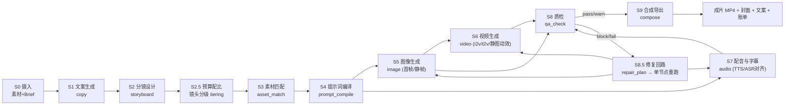

# 阶段 4：视频生成流水线
> 项目：AI 营销视频智能体（MVA）｜上游：阶段 1–3

---

## 4.0 流水线总览



**节点映射**：S1→`text` 节点；S2→`script` 节点；S2.5/S3/S4→`prompt_compile` 节点（内含 tiering 与素材绑定）；S5→`image`；S6→`video`；S7→`audio`；S8→`qa_check`；S9→`compose`。

---

## 4.1 S0 摄入：Brief 与素材

| 项 | 内容 |
|---|---|
| 输入 | 用户上传图/视频/音频/文本；五要素表单；Agent 澄清结果 |
| 输出 | `Brief`（§3.7.2）+ `asset[]`（含 `tags`、`portrait`、`embedding`、`consent`） |
| 处理 | MIME 嗅探 → 抽帧/缩略图 → pHash 去重 → 标签（VLM 打标）→ embedding → 审核 L1 |
| 失败 | 素材违规 → 剔除该素材并提示（不阻断整体，除非 `must_show` 命中违规） |
| 时延 | ≤ 3s/素材（并行） |

**自动打标**（VLM 一次性输出，写 `asset.tags`）：
```jsonc
{ "tags": ["气泡水","易拉罐","蓝色包装","冰镇","手部持握","户外","夏日"],
  "object": "beverage_can", "brand_visible": true, "portrait": false,
  "quality": { "sharpness": 0.82, "lighting": 0.71, "usable_as_hero": true },
  "safety": { "verdict": "pass", "categories": [] } }
```

---

## 4.2 S1 文案生成（`mva.copy.generate`）

| 项 | 内容 |
|---|---|
| 输入 | `Brief` |
| 输出 | `CopySet{variants: [3], recommended_index}`；每版含 `hook / body / cta / estimated_read_s` |
| 模型 | LLM（`temperature 0.8`，`json_mode`） |
| 校验 | `estimated_read_s = 字数/4.5 + 0.3`，与 `duration_s` 偏差 ≤ 15%，超标则自动二次压缩（"压缩到 N 字，保留 hook 与 CTA"） |
| 失败 | schema 失败 → 修复重试 ≤2；仍失败 → 模板句式兜底 |
| 成本/时延 | ≈ ¥0.02 / 6–10s |

```jsonc
// CopySet
{ "variants": [
    { "style": "痛点型", "hook": "还在为一到下午就犯困发愁？", "body": "0 糖 0 卡气泡水，冰镇一口，气泡在舌尖炸开。", "cta": "点击左下角，囤一箱", "estimated_read_s": 9.8 },
    { "style": "利益型", "hook": "0 糖也能这么爽？", "body": "...", "cta": "...", "estimated_read_s": 9.4 },
    { "style": "场景型", "hook": "加班到十点，冰箱里那罐救了我", "body": "...", "cta": "...", "estimated_read_s": 10.1 } ],
  "recommended_index": 0,
  "usp_coverage": { "0糖": true, "冰爽": true, "低卡": false } }
```
**选择策略**：MVP 由 LLM 给 `recommended_index`；用户可在画布上切换（text 节点多输出对比）。A/B 阶段（P1）按 `eval_result` 历史胜率选优。

---

## 4.3 S2 分镜设计（`mva.script.storyboard`）

| 项 | 内容 |
|---|---|
| 输入 | `Brief` + 选定 `CopySet.variant` + `consistency_bible` 种子（来自素材打标） |
| 输出 | `Storyboard`（§3.7.3） |
| 结构规则 | 镜头数 `n = clamp(round(duration_s / 4.2), 3, 12)`；单镜 2.5–6s；总时长误差 ≤10% |
| 叙事模板 | `hook(1镜) → 痛点/场景(1-2镜) → 产品展示(2-3镜) → 卖点演示(1-2镜) → CTA(1镜)` |
| 一致性 | 每个反复出现的实体分配 `subject_ref`；`consistency_bible` 固化外观描述（颜色/材质/形态/光线） |
| 失败 | 总时长偏差 >10% → 时长配平算法二次修正（不重调 LLM） |

### 时长配平算法（确定性，不依赖模型）
```python
def balance_durations(shots, target_s, min_s=2.5, max_s=6.0):
    # 1) 语音约束：镜头时长必须容得下该镜台词
    for sh in shots:
        need = len(sh.narration) / 4.5 + 0.3
        sh.duration_s = max(sh.duration_s, need)
    # 2) 场景权重：动作/产品特写给更多时间
    w = [1.2 if "特写" in sh.camera else 1.0 for sh in shots]
    # 3) 归一化并夹紧
    total = sum(sh.duration_s for sh in shots)
    for sh, wi in zip(shots, w):
        sh.duration_s = clamp(sh.duration_s * (target_s / total) * wi, min_s, max_s)
    # 4) 残差补偿到最长的镜头
    drift = target_s - sum(sh.duration_s for sh in shots)
    longest = max(shots, key=lambda s: s.duration_s)
    longest.duration_s = clamp(longest.duration_s + drift, min_s, max_s)
    assert abs(sum(s.duration_s for s in shots) - target_s) <= target_s * 0.10
    return shots
```

---

## 4.4 S2.5 预算配比：镜头分级（tiering）—— MVP 控本的关键

> 现实约束：i2v 高质量档 ≈ ¥0.8–1.5/秒，一条 20s 全 i2v 可能 ¥20+，**超出 ¥8 预算**。
> 因此必须在分镜后引入「镜头分级」，把预算花在关键镜头上。

| Tier | 生成方式 | 单位成本（示例，配置化） | 适用镜头 | 观感 |
|---|---|---|---|---|
| **T-A 高质** | i2v 高质档（可灵/即梦高档） | ¥0.8–1.5/s | hook 镜 + CTA 镜（≤2 镜） | 有真实运动 |
| **T-B 标准** | i2v 标准档 | ¥0.3–0.6/s | 产品展示、卖点演示（2–3 镜） | 轻运动 |
| **T-C 静图动效** | 单图 + Ken Burns/视差/推拉 + 粒子/光效 | ≈ ¥0.06/镜（仅图像生成 + 合成） | 场景铺陈、文字板、数据板 | 静止但有呼吸感 |
| **T-D 现有素材** | 直接用用户上传视频片段（裁剪/变速/调色） | ¥0 | 用户素材质量达标时 | 最佳（真实） |

```python
def assign_tiers(shots, budget_cny, brief, assets):
    """按预算自动配比；用户可在画布上覆盖任意镜头的 tier"""
    plan = [("T-D" if has_good_upload(s, assets) else "T-C") for s in shots]
    est = estimate(plan, shots)
    # 按优先级升级：hook > CTA > 卖点镜 > 场景镜
    for idx in priority_order(shots):            # [0, last, usp_shots..., others]
        for tier in ("T-B", "T-A"):
            if est - tier_cost(plan[idx]) + tier_cost(tier) <= budget_cny * 0.85:
                plan[idx] = tier; est = estimate(plan, shots); break
    return plan, est
```
> **产物**：每个 `video` 节点携带 `params.tier`，`video` 节点执行器据此走不同代码路径（i2v / 静图动效），对画布与 Agent 完全透明——这就是「新增能力不改画布核心」的体现。

---

## 4.5 S3 素材匹配（`mva.asset.match`）

| 项 | 内容 |
|---|---|
| 输入 | `Storyboard`（每镜 `visual`/`asset_hint`）+ 素材库 |
| 输出 | `AssetSelection[]`：`{shot_no, asset_id, score, reason, role(first_frame\|ref\|broll\|none), fallback_ids[]}` |
| 流程 | ①标签预筛 → ②向量检索 top-20（pgvector cosine） → ③重排（规则+VLM） → ④硬校验 → ⑤去重 |
| 硬校验 | `portrait=true` 且无有效 `consent` → **剔除**；`brand_visible` 且非本品牌 → 剔除（防侵权）；审核状态非 pass → 剔除 |
| 时延 | ≤ 1s/镜 |

### 打分公式（可调权重，落配置不落代码）
```
score = 0.45 * vector_cos(shot.visual, asset.embedding)
      + 0.25 * tag_overlap(shot.asset_hint, asset.tags)
      + 0.20 * vlm_fit(shot.visual, asset)          # VLM 0/0.5/1 三档
      + 0.10 * quality_score(asset)                 # S0 的 sharpness/lighting
      - penalty(portrait_without_consent=1.0, brand_mismatch=0.5, duplicate=0.3)
```
**阈值**：`≥0.72` 采用；`0.55–0.72` 作候选（交 PromptAgent 决定是否改用生成）；`<0.55` 判定"无合适素材" → 该镜走生成路径。
**去重**：`pHash` 汉明距离 ≤ 6 视为重复，同一素材不得作为两个相邻镜头首帧（视觉重复扣一致性分）。

---

## 4.6 S4 提示词编译（`mva.prompt.compile.{image,video}`）

### 4.6.1 组装算法（一致性核心）
```python
IDENTITY_CACHE: dict[str, str] = {}          # subject_ref -> 逐字固定的外观描述

def identity_block(subject_ref: str, bible: ConsistencyBible) -> str:
    if subject_ref not in IDENTITY_CACHE:                 # 只在首次生成，之后逐字复用
        IDENTITY_CACHE[subject_ref] = bible.describe(subject_ref)
    return IDENTITY_CACHE[subject_ref]

def build_shot_prompt(shot, bible, style, spec: ModelSpec, target="video") -> CompiledPrompt:
    core = [shot.visual, shot.camera, f"{shot.duration_s}s"]
    ident = [identity_block(shot.subject_ref, bible)] if shot.subject_ref else []
    look = [style.lighting, style.palette_text, *style.keywords]
    quality = ["4k", "高细节", "商业摄影"] if target == "image" else ["流畅运镜", "运动自然"]

    parts = core + ident + look + quality
    prompt = join_dedupe(parts, sep=", ")
    prompt = truncate(prompt, spec.max_prompt_chars,
                      drop_order=["quality", "look", "core.camera"])  # 绝不删 ident 与 core.visual
    negative = NEGATIVE_BASELINE[target] + style.forbidden + shot_risks(shot)
    return CompiledPrompt(
        prompt=prompt, negative_prompt=negative,
        params_hint={"ratio": "9:16", "resolution": spec.recommended_resolution,
                     "duration_s": shot.duration_s, "seed": stable_seed(shot.subject_ref)})
```
**`stable_seed(subject_ref)`**：同一实体在所有镜头使用**同一种子**（如 `crc32(ref) % 2**31`），显著提升跨镜一致性（配合固定 identity 描述与固定 style 前缀）。

### 4.6.2 负向词基线库
```yaml
NEGATIVE_BASELINE:
  image: [低分辨率, 模糊, 畸变, 多余肢体, 手指变形, 文字乱码, 水印, 版权标识, 过曝, 死黑, 塑料感, 廉价感]
  video: [闪烁, 画面抖动, 鬼影, 融化的物体, 物体形变, 运动模糊过重, 帧间跳变, 人物面部崩坏, 静态无动作]
shot_risks:      # 按镜头内容追加
  手部持握: [六指, 关节畸形]
  文字板: [错别字, 字形畸变, 排版错乱]
  液体: [飞溅不自然, 流动方向错误]
```

### 4.6.3 模型族适配矩阵（Adapter 层吸收差异，Agent 只见能力）
| 模型族 | prompt 风格 | 支持 | 不支持 | 编译策略 |
|---|---|---|---|---|
| `kling` | 中文自然语言叙述 | 首尾帧、负向词、种子 | >5s 单段 | 分镜切成 ≤5s 段，首尾帧衔接 |
| `jimeng` | 中文关键词+短语 | 首帧、比例丰富 | 长 prompt | 压缩到 ≤300 字符，删修饰词保主体 |
| `runway` | 英文关键词 | 镜头运动词丰富 | 中文 | 内置中→英术语表（"特写"→"close-up shot"） |
| `pika` | 英文短句 | 运动强度参数 | 首尾帧 | 运动强度映射到 1–4 档 |
| `doubao` | 中文 | 与 LLM 同生态 | — | 直接复用 |

> 术语表与每家 `max_prompt_chars`、支持的 `ratio/resolution/duration` 都由 `ModelSpec` 提供，**编译期读能力表**，不写死在 prompt 模板里。

---

## 4.7 S5 图像生成

| 项 | 内容 |
|---|---|
| 输入 | `CompiledPrompt` + 参考素材（可选：主体图、风格图、首帧） |
| 输出 | `image[]`（默认 `count=1` 关键镜 `count=4` 供挑选）+ `meta{seed, model, size}` |
| 参数 | `model, resolution(1080x1920), ratio(9:16), count, seed, ref_strength(0.3–0.7), style_preset` |
| 并发 | 每镜 ≤4 张并行；不同镜并行（受 adapter 并发/RPM 令牌桶限制） |
| 选择 | 多张时按 ①合规 ②清晰度 ③与 identity_block 的 VLM 一致性 自动选优，其余保留供用户切换 |
| 成本/时延 | ¥0.04–0.10/张；6–12s/张（P50） |
| 失败 | 审核拒 → 改写 prompt 重试 1 次（软化敏感表达）→ 仍拒则换风格（去掉可能触发的词）→ 最后降级用现有素材 |
| 幂等 | `seed + prompt_hash + model + size` 相同 → 直接命中缓存（**零成本复用**） |

---

## 4.8 S6 视频生成

| 项 | 内容 |
|---|---|
| 模式 | `i2v`（默认，用 S5 静帧作首帧，一致性最好）/ `t2v`（无合适静帧时）/ `v2v`（用户上传视频风格化）/ `static_motion`（T-C：FFmpeg 动效，不经模型） |
| 输入 | 首帧图（必需 for i2v）、尾帧图（可选，衔接下一镜）、`CompiledPrompt`、时长、种子 |
| 输出 | `video`（H.264/MP4，无音轨或保留原声可配） |
| 关键手段 | ①首帧=选定静帧（锁死主体外观）②同 `subject_ref` 同种子 ③**尾帧衔接**：用下一镜首帧作尾帧，实现无缝转场 ④单段 ≤ 模型上限（如 5s），长镜切段后拼接 |
| 成本/时延 | T-A ¥0.8–1.5/s、T-B ¥0.3–0.6/s；30–180s/段（异步 + 回调） |
| 失败 | `transient` → 重试 ≤3；`content_blocked` → 换 prompt 重试 1 次；质量不达标（由 S8 判定）→ 换种子重跑（≤2 次）→ 降级 T-C 静图动效 |
| 幂等 | `idempotency_key = sha256(run:node:first_frame_md5:prompt_hash:model:seed:duration)` |

**短视频段落切分**：
```python
def split_for_model(shot, spec):
    if shot.duration_s <= spec.max_duration_s: return [shot]
    n = ceil(shot.duration_s / spec.max_duration_s)
    segs = split_shot(shot, n)              # 按动作语义切分（如"举起→倾倒→喝下"）
    return segs                             # 相邻段用尾帧衔接
```

---

## 4.9 S7 配音、字幕与音频

### 4.9.1 TTS（`audio` 节点，mode=tts）
| 项 | 内容 |
|---|---|
| 输入 | `narration`（分镜台词拼接）+ 音色/语速/情绪 |
| 输出 | `audio` + `timestamps[]`（字级，若适配器支持）|
| 参数 | `voice_id, speed(0.9–1.15), emotion, model, sample_rate(48k)` |
| 对齐 | 适配器不返回时间戳时，用 **ASR 强制对齐**（或按标点+字数比例估算，误差 ≤200ms）|
| 校验 | 实际时长 vs 分镜预算偏差 >15% → 微调 `speed` 或改分镜（提示 Agent）|
| 成本/时延 | ¥0.02/百字；3–8s |

### 4.9.2 字幕
- 断句规则：按 `on_screen_text` + 语音段落，单条 ≤14 字，停留 ≥0.8s，行 ≤2 行。
- 样式：品牌套件（字体/字号/描边/位置）；抖音安全区：距上下边 ≥ 250px、右 ≥ 120px 不放关键文字。
- 输出 ASS 文件（由 `timestamps` 生成）供 FFmpeg 烧录。

### 4.9.3 BGM / 音效
| 项 | 内容 |
|---|---|
| 来源 | 授权曲库（内置 `music_library`，每条含 `license_id`、`bpm`、`mood`、`duration`），或用户上传 |
| 选择 | 按 `Brief.style.tone` + `pace` 匹配 mood/bpm；**仅使用曲库内已授权曲目** |
| 混音 | 人声为主：BGM `-14 → -20 dB`，**sidechain 闪避**（人声起时 BGM 自动降 6dB）|
| 响度 | 最终 `loudnorm I=-14 LUFS, TP=-1.5 dBTP`（贴合短视频平台）|
| 版权 | 曲目 `license_id` 写入成片元数据与账单，可追溯 |

---

## 4.10 S8 质检（`qa_check`）—— 规则表

### 4.10.1 规则与阈值
| 规则 | 引擎 | 指标/公式 | pass | warn | block |
|---|---|---|---|---|---|
| **一致性 consistency** | CLIP/embedding + VLM | `sim = cos(emb(shot_i), emb(ref_keyframe(subject_ref)))`；VLM 三命题（颜色/形状/文字） | sim ≥0.82 且 命题 ≥2/3 | 0.72–0.82 或 命题 1/3 | sim <0.72（hero 镜）或 命题 0/3 |
| **画质 quality** | OpenCV | 拉普拉斯方差 ≥60；亮度均值 40–220；黑帧/彩条检测；帧差突变 | 全通过 | 1 项越界 | 模糊/黑帧/花屏 |
| **文案准确 text_accuracy** | ASR + 文本比对 | 字幕 CER ≤5%；USP 覆盖率 = 命中数/总数 ≥0.8；禁用词精确命中 | CER ≤5% 且覆盖 ≥0.8 | CER 5–10% | 禁用词命中 ∨ CER >10% ∨ 编造价格/资质 |
| **音画同步 sync** | 音频对齐 | `|audio_offset| ≤120ms`；字幕 cue 与语音段 IoU ≥0.7 | 通过 | 120–250ms | >250ms |
| **平台合规 platform** | 规则 | 时长/比例/码率达标；关键文字未入遮挡安全区 | 通过 | 轻微越界 | 比例/时长不达标 |
| **内容合规 compliance** | 审核 API + 广告法词库 | 敏感/暴力/低俗/医疗功效/绝对化用语（最、第一、国家级、100%） | 通过 | 模糊宣称（"最好用"） | 命中红线 |
| **AI 标识** | 规则 | 元数据含 `ai_generated=true` + 平台声明字段 | 通过 | — | 缺失（阻断导出）|
| **成本/时延** | 账本 | `spent ≤ budget`；`latency ≤ 目标×1.5` | 通过 | 超预算 80% | 超预算 |

### 4.10.2 总分与裁决
```
total = 0.25*consistency + 0.25*quality + 0.20*text_accuracy + 0.15*sync + 0.15*compliance
verdict = "block" if any(rule == block) else ("warn" if total < 0.80 or any warn else "pass")
```
- `block` → 该镜不计入成片，进修复回路（**不阻断其他镜头**）；
- `warn` → 进成片但标记，UI 提示「建议替换」并提供一键重跑；
- 成片级：任一镜头 `block` 且无法修复 → run = `partial`，只导出可用部分 + 明确告知。

### 4.10.3 修复回路（`mva.qa.repair.plan` → 单节点重跑）
| 问题码 | 修复动作 | 最大次数 |
|---|---|---|
| `CONSISTENCY_DRIFT` | 提高 `ref_strength`、锁定同一 seed、在 prompt 中强化 identity 描述 | 2 |
| `MOTION_ARTIFACT` | 降 `motion_strength`、换 adapter、缩短时长 | 2 |
| `BLUR_OR_NOISE` | 换种子重跑、提高分辨率 | 2 |
| `TEXT_MISMATCH` | 改 `on_screen_text` 或重新 TTS（调 speed） | 2 |
| `AUDIO_SYNC` | 重新对齐字幕 / 重跑 TTS | 1 |
| `POLICY_BLOCKED` | 改写 prompt 软化表达；仍拒 → 该镜改静态素材 + 文字板 | 1 |
| 重试耗尽 | 降级：该镜改 T-B → T-C；仍失败 → 提示用户换素材 | — |

---

## 4.11 一致性策略总表（跨镜头一致性五层机制）

| 层 | 机制 | 实现位置 |
|---|---|---|
| L1 语义层 | `subject_ref` + `consistency_bible` 固化外观词典 | Storyboard（S2） |
| L2 文本层 | 同一 `subject_ref` 注入**逐字相同**的 identity 描述 + 固定 style 前缀 | Prompt 编译（S4） |
| L3 随机层 | `stable_seed(subject_ref)`：同实体同种子；同 run 全局固定 style 前缀 | Prompt 编译 + Adapter |
| L4 视觉层 | 首帧由 S5 静帧锁定；跨镜用**尾帧衔接**；素材优先（T-D） | 图像/视频（S5/S6） |
| L5 校验层 | CLIP 相似度 + VLM 三命题 → 不达阈值触发修复回路（提高 ref_strength / 重跑） | 质检（S8） |

**人物一致性额外手段**（P1）：人脸 embedding + 授权肖像库（`portrait_asset`），生成时用 IP-Adapter/参考图，并强制 `consent` 校验。

---

## 4.12 模型适配器接口（统一出口）

```python
from abc import ABC, abstractmethod
from decimal import Decimal
from enum import Enum

class Capability(str, Enum):
    LLM="llm"; VLM="vlm"; IMAGE="image"; VIDEO="video"; TTS="tts"; ASR="asr"; MUSIC="music"

@dataclass(frozen=True)
class ModelSpec:
    adapter: str; model: str; capability: Capability
    price: Decimal; price_unit: str            # per_image | per_second | per_1k_chars | per_1k_tokens
    max_prompt_chars: int
    ratios: tuple[str, ...]; resolutions: tuple[str, ...]
    max_duration_s: int | None = None
    supports_callback: bool = False
    supports_seed: bool = False
    supports_first_frame: bool = False
    supports_last_frame: bool = False
    supports_negative_prompt: bool = False
    concurrency: int = 4; rpm: int = 60
    commercial_use: bool = True; region: str = "cn"
    quality_tier: str = "B"                    # A/B 用于自动选型

@dataclass
class GenerationRequest:
    prompt: str; negative_prompt: str | None = None
    refs: list[str] = field(default_factory=list)     # 参考图/首尾帧 URL
    params: dict = field(default_factory=dict)        # ratio/resolution/duration/seed...
    callback_url: str | None = None
    idempotency_key: str = ""
    timeout_s: int = 600

@dataclass
class TaskHandle:
    adapter: str; external_task_id: str; submitted_at: datetime

@dataclass
class TaskStatus:
    state: Literal["queued","running","succeeded","failed"]
    progress: float | None = None
    error: "MvaError | None" = None

@dataclass
class GenerationResult:
    artifacts: list[ArtifactRef]               # 已转存对象存储
    meta: dict                                  # seed/model/实际参数/水印信息
    raw: dict | None = None

class BaseAdapter(ABC):
    spec: ModelSpec

    @abstractmethod
    async def submit(self, req: GenerationRequest) -> TaskHandle: ...
    @abstractmethod
    async def poll(self, handle: TaskHandle) -> TaskStatus: ...
    @abstractmethod
    async def fetch(self, handle: TaskHandle) -> GenerationResult: ...
    @abstractmethod
    def estimate_cost(self, req: GenerationRequest) -> Decimal: ...
    @abstractmethod
    def normalize_error(self, exc: Exception) -> "MvaError": ...   # → transient|rate_limited|...
    async def cancel(self, handle: TaskHandle) -> None: ...        # 可选实现
    def parse_callback(self, payload: dict) -> TaskStatus: ...     # 支持回调者实现
```

### ModelGateway 职责
1. **选型**：按 `capability + quality_tier + 预算 + 可用性` 从注册表挑 adapter（优先级链可配）。
2. **限流**：`rate:{adapter}` 令牌桶 + `sem:{adapter}` 并发信号量；429 → 降速重排（不失败）。
3. **重试**：按阶段 2 §2.4.4 矩阵；重试用同一 `external_task_id` 查询优先。
4. **回调归一**：各厂商回调 → 统一 `TaskStatus` → 事件总线 → WS 推送。
5. **降级链**：主 adapter 不可用/超预算 → 切同能力备用（记录成本变化并提示用户）。
6. **产物转存**：外部 URL → 对象存储（防过期链接），计算 md5，写 `artifact`。
7. **成本记账**：每次调用写 `cost_ledger`（含重试产生的真实花费）。

### 适配器注册（例子）
```python
REGISTRY.register(KlingVideoAdapter(ModelSpec(
    adapter="kling", model="kling-v2", capability=Capability.VIDEO,
    price=Decimal("0.90"), price_unit="per_second", max_prompt_chars=1500,
    ratios=("9:16","16:9","1:1"), resolutions=("1080x1920",),
    max_duration_s=5, supports_callback=True, supports_seed=True,
    supports_first_frame=True, supports_last_frame=True, supports_negative_prompt=True,
    concurrency=3, rpm=30, quality_tier="A")))
REGISTRY.register(MockImageAdapter(...))     # 离线联调：返回本地占位图，成本 0
```

---

## 4.13 成本与时延预算（20s / 6 镜 示例）

### 成本（示例价格，全部配置化，可热更新）
| 阶段 | 用量 | 单价 | 小计 |
|---|---|---|---|
| 文案 + 分镜 + 编译（LLM×4） | ≈ 12k tokens | — | ¥0.06 |
| 图像（6 镜 × 1 张 + 重跑 20%） | 7.2 张 | ¥0.06 | ¥0.43 |
| 视频 T-A ×2 镜（4s+4s） | 8s | ¥0.90/s | ¥7.20 |
| 视频 T-B ×2 镜 | 8s | ¥0.45/s | ¥3.60 |
| 静图动效 T-C ×2 镜 | 2 镜 | — | ¥0 |
| TTS | ≈ 120 字 | ¥0.02/百字 | ¥0.03 |
| 质检（VLM 抽帧 6×2 + ASR） | — | — | ¥0.12 |
| 合成（CPU） | 1 次 | — | ¥0.02 |
| **合计** | | | **≈ ¥11.5** ⚠️ |

**结论：必须靠 tiering 把预算压进 ¥8**。按 §4.4 算法在 ¥8 预算下的典型配比：
| 配比 | 结果 |
|---|---|
| 2×T-A + 1×T-B + 3×T-C | ¥7.2 + ¥1.8 + ¥0 ≈ **¥9.0** → 仍超 → |
| 1×T-A(hook) + 2×T-B + 3×T-C | ¥3.6 + ¥3.6 + 0 ≈ **¥7.2** ✅ 落在 ¥8 内（含质量重跑余量 ¥0.8）|
> 该配比就是**默认策略**：hook 用最高档抓人，2 个关键镜用标准档，其余静图动效。用户可手动把任意镜升档（实时看到预算条变化）。

### 时延（关键路径）
| 阶段 | P50 | P95 | 并行度 |
|---|---|---|---|
| S1–S4（LLM 链） | 35s | 70s | 部分并行 |
| S5 图像 6 镜 | 50s | 110s | 镜间并行、镜内 ≤4 张 |
| S6 视频 3 段（T-A/B） | 150s | 420s | ≤3 并发（受 RPM 限制） |
| S7 TTS | 8s | 20s | 1 |
| S8 质检 | 25s | 60s | 规则并行 |
| S9 合成 | 30s | 90s | 1 |
| **总计（关键路径）** | **≈ 5min** | **≈ 13min** | 满足 A6（P50 ≤8min / P95 ≤20min）|

**优化手段**：模型调用全部异步回调（不占 worker）；产物缓存命中（同 seed/prompt 直接复用）；S5/S6 提前启动（首镜编译完成即提交，不等全部分镜编译完）。

---

## 4.14 失败模式与恢复矩阵（按阶段）

| 阶段 | 失败模式 | 检测 | 自动恢复 | 兜底 |
|---|---|---|---|---|
| S0 | 素材违规/损坏 | 审核 + ffprobe | 剔除素材 | 用生成素材替代 |
| S1 | 文案超长/含禁用词 | schema + 词库 | 二次压缩/改写 | 模板句式 |
| S2 | 时长不达标 | 断言 | 时长配平算法 | 减少镜头数 |
| S3 | 无合适素材 | score <0.55 | 转生成路径 | 纯生成素材 |
| S4 | prompt 超长/含敏感词 | 长度+审核 | 按 drop_order 裁剪 / 软化 | 关键词极简版 |
| S5 | 审核拒绝/超时 | 适配器错误 | 改 prompt 重试 1 → 换种子 | 用现有素材静帧 |
| S6 | 队列拥堵/失败/质量差 | 超时扫描 + 质检 | 切备用 adapter / 换种子 ≤2 | 降级 T-C 静图动效 |
| S7 | TTS 音色不可用/时长不符 | 适配器 + 时长校验 | 换音色 / 调 speed | 纯字幕无配音 |
| S8 | 质检服务异常 | 超时 | 降级为「仅规则引擎」（不做 VLM） | 标记 `qa_degraded` 并提示人工复核 |
| S9 | FFmpeg 失败/磁盘满 | 退出码/磁盘探针 | 重试 1 次（降码率） | 导出无字幕/无 BGM 版本 |

**断点续跑**：任何阶段失败后，`POST /runs/{id}/resume` 只重跑该镜相关节点，其余节点复用缓存产物（成本不重复发生）。

---

**下一步**：确认后进入 **阶段 5：前端画布设计** —— 节点类型 TypeScript 定义、自定义节点组件结构、节点数据流模型、连线端口校验规则、前端执行引擎（拓扑排序与调度）、工作流 JSON Schema、WebSocket 协议。
