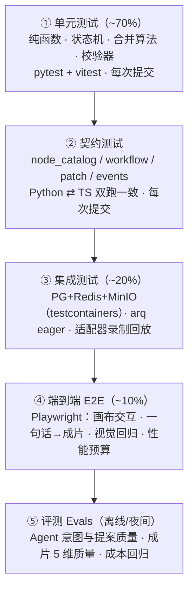

# 阶段 8：测试与评测
> 项目：AI 营销视频智能体（MVA）｜原则：**确定性可测的与随机的分离测试**——确定性逻辑用严格断言，模型相关用统计阈值 + 录制回放。

---

## 8.0 测试金字塔与门禁



| 层 | 覆盖目标 | 运行时机 | 失败处理 |
|---|---|---|---|
| 单元 | 核心纯函数行覆盖 ≥90%，整体 ≥75% | 每次 push | 阻塞合并 |
| 契约 | 100% 契约文件有测试 | 每次 push | 阻塞合并 |
| 集成 | 关键路径（patch→run→WS→导出） | 每次 PR | 阻塞合并 |
| E2E | 阶段 1 §8 DoD 的 10 条 | 每次 PR（并行 4 worker） | 阻塞合并 |
| 评测 | Agent/成片指标达标 | 夜间 + 发版前 | 发版阻塞（打标签放行） |

---

## 8.1 单元测试

### 8.1.1 后端（pytest）目录
```
apps/api/tests/
├── conftest.py
├── unit/
│   ├── engine/test_dag.py            # 拓扑排序、环检测、子图补全
│   ├── engine/test_patch_apply.py    # 快路径应用 + 硬规则（locked/端口/环）
│   ├── engine/test_three_way_merge.py# 三方合并（含 hypothesis 属性测试）
│   ├── engine/test_idempotency.py    # input_hash 稳定性与敏感性
│   ├── engine/test_budget.py         # 预算闸门与 80% 预警
│   ├── engine/test_stale.py
│   ├── pipeline/test_balance_durations.py
│   ├── pipeline/test_prompt_compile.py    # identity 逐字复用、裁剪顺序、负向词
│   ├── pipeline/test_tiering.py           # 镜头分级配比不超预算
│   ├── pipeline/test_qa_rules.py          # 每条质检规则边界值
│   ├── adapters/test_error_normalize.py   # 厂商错误码 → 6 类映射
│   └── services/test_cost_model.py
└── contract/test_contracts.py
apps/web/src/**/*.test.ts(x)          # vitest：applyPatch / buildPlan / validateConnection / resolveInputs
```

### 8.1.2 关键用例（真实断言）
```python
# unit/engine/test_dag.py
def test_cycle_detected():
    g = graph([n("a"), n("b")], [e("a", "b", "out", "in"), e("b", "a", "out", "in")])
    with pytest.raises(MvaError) as ei: build_plan(g, "full", None)
    assert ei.value.code == "CYCLE_DETECTED"

def test_subgraph_includes_upstream_but_marks_reuse():
    g = graph([n("a"), n("b"), n("c")], [e("a","b","out","in"), e("b","c","out","in")])
    plan = build_plan(g, "subgraph", ["c"], include_upstream=True)
    assert set(plan.order) == {"a", "b", "c"}
    assert plan.deps["c"] == {"b"}

def test_levels_are_parallel_groups():
    g = graph([n("a"), n("b"), n("c")], [e("a","c","out","in"), e("b","c","out","in")])
    assert build_plan(g, "full", None).levels == [["a", "b"], ["c"]]

# unit/engine/test_idempotency.py
def test_input_hash_stable_and_sensitive():
    g = graph([n("a", content="x"), n("b")], [e("a","b","out","in")])
    h1 = input_hash(g, g["nodes"][1], {"a": "md5_1"})
    assert h1 == input_hash(g, g["nodes"][1], {"a": "md5_1"})          # 稳定
    assert h1 != input_hash(g, g["nodes"][1], {"a": "md5_2"})          # 上游变则变
    g2 = deepcopy(g); g2["nodes"][1]["params"]["seed"] = 42
    assert h1 != input_hash(g2, g2["nodes"][1], {"a": "md5_1"})        # 参数变则变

# unit/pipeline/test_balance_durations.py
@pytest.mark.parametrize("target,n", [(15, 5), (20, 6), (30, 8), (60, 12)])
def test_balance_within_10pct(target, n):
    shots = [shot(duration_s=random.uniform(1, 8), narration="字" * 20) for _ in range(n)]
    out = balance_durations(shots, target)
    assert abs(sum(s.duration_s for s in out) - target) <= target * 0.10
    assert all(2.5 <= s.duration_s <= 6.0 for s in out)

# unit/pipeline/test_prompt_compile.py
def test_identity_block_is_verbatim_across_shots():
    bible = ConsistencyBible(subject_ref={"hero": "蓝色易拉罐，420ml，哑光标签"})
    p1 = build_shot_prompt(shot(subject_ref="hero", visual="产品特写"), bible, style, spec)
    p2 = build_shot_prompt(shot(subject_ref="hero", visual="冰水中", camera="环绕"), bible, style, spec)
    assert bible.describe("hero") in p1.prompt and bible.describe("hero") in p2.prompt

def test_truncate_never_drops_identity_or_subject():
    long_style = Style(keywords=[f"kw{i}" for i in range(200)])
    p = build_shot_prompt(shot(subject_ref="hero", visual="主体动作"), bible, long_style, short_spec)
    assert len(p.prompt) <= short_spec.max_prompt_chars
    assert "主体动作" in p.prompt and bible.describe("hero") in p.prompt

# unit/pipeline/test_qa_rules.py
@pytest.mark.parametrize("brightness,expect", [(30, "block"), (120, "pass"), (250, "block")])
def test_brightness_rule(brightness, expect, blank_frame):
    assert quality_rule(blank_frame(brightness=brightness)).verdict == expect

# unit/engine/test_budget.py
def test_budget_blocks_and_warns():
    run = fake_run(limit=Decimal("8"), spent=Decimal("7.5"))
    with pytest.raises(MvaError) as ei: asyncio.run(BudgetGuard(cost).assert_ok(run, est(1.0)))
    assert ei.value.code == "BUDGET_EXCEEDED"
    assert any(e["type"] == "cost.warning" for e in bus.sent)     # 80% 预警已发
```

### 8.1.3 属性测试（三方合并 —— 最容易出静默 bug 的地方）
```python
from hypothesis import given, strategies as st

@given(graph_st(), patch_st())
def test_merge_is_total_and_keeps_user_values(g, p):
    out, conflicts = three_way_merge(base=g, current=g, ops=p.ops, incoming_author="agent")
    assert is_valid_graph(out)                       # 结果永远合法（无环/端口类型正确/无悬空边）
    assert len(out.nodes) >= len(g.nodes) - 2        # 不会大范围误删
    assert all(c.reason in CONFLICT_REASONS for c in conflicts)

@given(graph_st(), patch_st())
def test_apply_idempotent_on_same_base(g, p):        # 同一 patch 应用两次 == 应用一次
    once, _ = three_way_merge(g, g, p.ops, "agent")
    twice, _ = three_way_merge(g, once, p.ops, "agent")
    assert graph_digest(twice) == graph_digest(once)
```

### 8.1.4 前端（vitest）
```ts
// applyPatch.test.ts —— 与后端 fixtures 同源
import fixtures from '@mva/contracts/fixtures/apply_patch.json';
describe('applyPatch', () => {
  fixtures.cases.forEach(({ name, graph, ops, expected }) => {
    it(name, () => expect(applyPatch(graph, { ops })).toEqual(expected));
  });
});

// validateConnection.test.ts
it('rejects audio → image', () =>
  expect(validateConnection(conn('a', 'out:out', 'b', 'in:prompt'), graphOf('audio', 'image')).ok)
    .toBe(false));

it('warns on unlicensed portrait upstream', () =>
  expect(validateConnection(conn('img', 'out:out', 'vid', 'in:first'),
         graphWithPortrait(consent=false)).severity).toBe('warn'));

// resolveInputs.test.ts —— 钉住值优先级最高
it('pinned beats edge', () => {
  const { values } = resolveInputs('n2', graph, { run: { 'n1:out:out': imgRef('A') },
                                                    lastGood: {} , pinned: { 'n2:in:image': 'B' }});
  expect(values.image.items[0].id).toBe('B');
});
```

---

## 8.2 契约测试（防前后端漂移）

```
packages/contracts/
├── node_catalog.json                 # 单一来源
├── workflow.schema.json / patch.schema.json / events.schema.json
├── fixtures/
│   ├── apply_patch.json              # [{name, graph, ops, expected}]
│   ├── validate_connection.json      # [{name, graph, conn, ok, reason, severity}]
│   ├── node_run_key.json             # [{graph, digest_map, expected_hash}]
│   └── ws_events/*.json              # 事件样例（前端必须能解析）
└── test_contracts.py / contracts.test.ts
```

```python
# packages/contracts/test_contracts.py
def test_node_catalog_matches_backend_executors():
    catalog = load_json("node_catalog.json")
    for spec in catalog["node_types"]:
        ex = EXECUTORS[spec["id"]]
        assert set(p["id"] for p in spec["inputs"]) == set(PORTS[spec["id"]]["inputs"])
        assert ex.validate.__doc__ is not None or True          # 类型存在即注册
    assert set(catalog["node_types_ids"]) == set(EXECUTORS)

def test_ws_event_fixtures_are_valid():
    for f in Path("fixtures/ws_events").glob("*.json"):
        EventSchema.validate(load_json(f))                      # 前端将用同一 schema 解析

def test_input_hash_matches_golden():
    for case in load_json("fixtures/node_run_key.json"):
        assert input_hash(case["graph"], case["node_id"], case["digest_map"]) == case["expected_hash"]
```
```ts
// contracts.test.ts —— 与 Python 相同输入必须产出相同结果
it('applyPatch matches python golden', () => {
  fixtures.apply_patch.cases.forEach(c =>
    expect(applyPatch(c.graph, { ops: c.ops })).toEqual(c.expected));
});
```
> **CI 门禁**：`make contracts` 重生成 `node_catalog.json` 后工作区必须无 diff（否则说明有人手改了绑定而没改契约）。

---

## 8.3 集成测试

### 8.3.1 环境与 conftest
```python
# apps/api/tests/conftest.py
@pytest_asyncio.fixture(scope="session")
async def postgres():
    with PostgresContainer("pgvector/pgvector:pg16") as pg:      # testcontainers
        yield pg.get_connection_url()

@pytest_asyncio.fixture
async def db(postgres):
    await run_migrations(postgres)
    async with session_scope() as s: yield s
    await truncate_all(postgres)                                 # 每用例干净开局

@pytest.fixture(autouse=True)
def freeze_clock(monkeypatch):
    clock.freeze("2026-01-01T00:00:00Z")

@pytest.fixture(autouse=True)
def seed_rng():
    random.seed(1234); faker.seed(1234)                          # 去随机化

@pytest.fixture
def eager_worker(monkeypatch):
    """arq eager 模式：入队即同步执行，测试无需真 worker"""
    monkeypatch.setattr(worker, "enqueue", lambda kind, **p: JOBS[kind](fake_ctx, **p))
```

### 8.3.2 关键集成用例
```python
async def test_patch_concurrent_conflict_keeps_user_value(db, client, auth):
    wf = await create_demo_workflow(db)                       # version=1, n_3.prompt="A"
    await client.patch(f"/workflows/{wf.id}", json=patch_params("n_3", {"prompt": "USER"}),
                       headers=auth)                          # version → 2（用户手改）
    r = await client.post(f"/workflows/{wf.id}/patches", headers=auth, json={
        "base_version": 1, "author": "agent", "rationale": "优化",
        "ops": [{"op": "update_node_params", "node_id": "n_3", "params": {"prompt": "AGENT"}}]})
    body = r.json()
    assert body["status"] == "partially_applied"
    assert body["conflicts"][0]["reason"] == "FIELD_MODIFIED_BY_USER"
    wf2 = await get_workflow(db, wf.id)
    assert node(wf2, "n_3")["params"]["prompt"] == "USER"     # ⭐ 用户值优先
    assert wf2.version == 3                                   # 版本前进，无 lost update

async def test_run_is_idempotent_on_double_click(db, client, auth, eager_worker):
    run = await create_run(client, auth, wf_id)
    await client.post(f"/runs/{run}/nodes/n_img/retry", headers=auth, json={"force": False})
    await client.post(f"/runs/{run}/nodes/n_img/retry", headers=auth, json={"force": False})
    rows = await db.fetch_all(select(NodeRun).where(NodeRun.run_id == run))
    assert len([r for r in rows if r.node_id == "n_img"]) == 1   # 幂等键唯一，只有一行

async def test_resume_reuses_finished_nodes(db, client, auth, eager_worker):
    run = await run_until_failed(db, fail_node="n_vid_1")
    spent_before = await spent(db, run)
    rr = await client.post(f"/runs/{run}/resume", headers=auth)
    assert rr.json()["reused"] >= 5                             # 已完成节点全部复用
    assert await spent(db, run) == spent_before                 # 复用零成本

async def test_ws_replays_events_after_reconnect(db, client, auth, ws):
    await create_run(client, auth, wf_id)
    seq = await ws.read_until(lambda e: e["type"] == "node.status", timeout=10)
    await ws.close()
    ws2 = await connect_ws(wf_id, since=seq)                    # 带 since 重连
    seen = [e async for e in ws2.read(5)]
    assert seen[0]["seq"] == seq + 1                            # 不丢事件

async def test_callback_dedupe_and_signature(db, client):
    body = callback_body("task_1", "succeed")
    sig = hmac_sign(body)
    r1 = await client.post("/webhooks/models/mock-video", content=body,
                           headers={"X-MVA-Signature": sig, "X-MVA-Timestamp": now_ts()})
    r2 = await client.post(...same...)                           # 重复回调
    assert r1.json()["ok"] and r2.json()["deduped"]
    r3 = await client.post(...bad sig...)
    assert r3.status_code == 401
```

### 8.3.3 适配器一致性测试套件（每个 adapter 必须通过）
```python
# apps/api/tests/adapters/test_adapter_contract.py
@pytest.mark.parametrize("adapter", all_registered_adapters())   # mock 与 live 都跑
def test_adapter_contract(adapter):
    assert adapter.spec.price >= 0 and adapter.spec.price_unit in PRICE_UNITS
    assert adapter.spec.max_prompt_chars > 0 and adapter.spec.rpm > 0
    est = adapter.estimate_cost(GenerationRequest(prompt="x", params={"duration_s": 5}))
    assert Decimal("0") <= est <= Decimal("50")                  # 估价合理区间
    for code, (cls, _) in adapter.error_map().items():           # 错误映射必须落在 6 类内
        assert cls in {"transient","rate_limited","quota_exceeded",
                       "content_blocked","invalid_request","fatal"}
    assert adapter.normalize_error(TimeoutError()).code == "transient"
```

### 8.3.4 模型调用录制回放（省钱且可复现）
```python
# 录制：MODEL_MODE=live VCR_RECORD=1 pytest -k live
# 回放：CI 默认 VCR 模式，按 (adapter, model, prompt_hash) 命中 fixtures/cassettes/*.json
@pytest.fixture(autouse=True)
def vcr_cassette(request):
    with vcr.use_cassette(f"fixtures/cassettes/{request.node.name}.yaml",
                          record_mode=settings.vcr_mode) as c:
        yield c
```
> 每个真实 adapter 上线前必须提交至少 1 组真实响应样本（含失败/限流/审核拒三类），用于回归错误映射与解析逻辑。

---

## 8.4 端到端测试（Playwright，含画布交互）

### 8.4.1 环境
```ts
// playwright.config.ts
export default defineConfig({
  testDir: './e2e',
  workers: 4, retries: 1, fullyParallel: true,
  webServer: [
    { command: 'make up-mock', url: 'http://localhost:8000/healthz', reuseExistingServer: true },
    { command: 'npm run dev',  url: 'http://localhost:5173',         reuseExistingServer: true },
  ],
  use: { baseURL: 'http://localhost:5173', trace: 'on-first-retry', video: 'retain-on-failure' },
});
```
**testid 约定**：`node-{id}`、`node-{id}-handle-{in|out}:{port}`、`toolbar-run`、`proposal-accept`、`toast-error`、`cost-meter`、`run-toolbar-run-all`。

### 8.4.2 画布交互用例
```ts
test('拖入节点 → 连线 → 运行 → 状态变绿', async ({ page }) => {
  await page.goto(`/w/${wfId}`);
  await page.getByTestId('palette-text').dragTo(page.getByTestId('canvas-pane'),
                                                { targetPosition: { x: 300, y: 200 } });
  await page.getByTestId('palette-image').dragTo(page.getByTestId('canvas-pane'),
                                                { targetPosition: { x: 700, y: 200 } });
  const [t, i] = await page.locator('[data-testid^="node-n_"]').all();
  await connect(page, t, 'out:out', i, 'in:prompt');                    // 拖端口连线
  await page.getByTestId('run-toolbar-run-all').click();
  await expect(page.getByTestId(`node-${idOf(i)}`)).toHaveAttribute('data-status', 'running');
  await expect(page.getByTestId(`node-${idOf(i)}`)).toHaveAttribute('data-status', 'success',
                                                                    { timeout: 30_000 });
  await expect(page.getByTestId('toast-error')).toHaveCount(0);
});

test('类型不匹配的连线被拒绝且无新边', async ({ page }) => {
  const before = await edgeCount(page);
  await connect(page, audioNode, 'out:out', imageNode, 'in:image');     // audio → image
  await expect(page.getByTestId('toast-error')).toContainText('类型不匹配');
  expect(await edgeCount(page)).toBe(before);
});

test('会成环的连线被拒绝', async ({ page }) => { /* A→B 后尝试 B→A，断言 toast「循环依赖」 */ });

test('撤销可回滚 Agent 的整批改动', async ({ page }) => {
  await page.getByTestId('agent-input').fill('突出 0 糖');
  await page.getByTestId('agent-send').click();
  await page.getByTestId('proposal-accept').click();
  const after = await nodeCount(page);
  await page.keyboard.press('Control+z');
  await expect.poll(() => nodeCount(page)).toBeLessThan(after);          // 整批回滚
});

test('打组 → 存模板 → 新画布实例化', async ({ page }) => {
  await selectNodes(page, 3);
  await page.keyboard.press('Control+g');
  await expect(page.getByTestId('group-g_main')).toBeVisible();
  await page.getByTestId('save-as-template').click();
  await page.getByLabel('模板名').fill('产品图生视频');
  await page.getByTestId('template-save-confirm').click();
  await page.goto(`/w/${newWfId}`);
  await page.getByTestId('template-item-产品图生视频').click();
  await expect.poll(() => nodeCount(page)).toBeGreaterThanOrEqual(3);
});

test('导出 JSON → 导入还原一致', async ({ page }) => {
  const json = await exportJson(page);
  await page.goto(`/w/${freshWfId}`);
  await importJson(page, json);
  expect(await graphDigest(page)).toBe(await graphDigestOf(json));       // 摘要一致
});

test('单节点失败不阻塞无关分支，可单独重试', async ({ page }) => {
  await seedFailingNode(page, 'n_img_2');                                // 后端测试钩子
  await page.getByTestId('run-toolbar-run-all').click();
  await expect(page.getByTestId('node-n_img_2')).toHaveAttribute('data-status', 'failed');
  await expect(page.getByTestId('node-n_tts')).toHaveAttribute('data-status', 'success'); // 无关分支照跑
  await clearFailingNode(page, 'n_img_2');
  await page.getByTestId('node-n_img_2').getByTestId('toolbar-retry').click();
  await expect(page.getByTestId('node-n_img_2')).toHaveAttribute('data-status', 'success');
});

test('预算超限弹窗并阻断运行', async ({ page }) => {
  await setBudget(page, 0.5);
  await page.getByTestId('run-toolbar-run-all').click();
  await expect(page.getByTestId('budget-dialog')).toContainText('超出上限');
  await expect(page.getByTestId('run-toolbar-run-all')).toBeEnabled();   // 未开始执行
});

test('一句话 → 成片（冒烟，Mock 模式）', async ({ page }) => {
  await createProjectViaUI(page, { goal: '种草', product: '气泡水', platform: '抖音',
                                   duration: 20, style: '清爽' });
  await page.getByTestId('agent-input').fill('做一条 20s 抖音种草视频，突出 0 糖');
  await page.getByTestId('agent-send').click();
  await page.getByTestId('proposal-accept').click();
  await page.getByTestId('run-toolbar-run-all').click();
  await expect(page.getByTestId('run-status')).toHaveText('已完成', { timeout: 180_000 });
  const href = await page.getByTestId('final-video-open').getAttribute('href');
  expect(await probeMp4(href)).toMatchObject({ durationMs: within(20_000, 0.15),
                                               width: 1080, height: 1920 });
});
```

### 8.4.3 性能预算测试（画布 200 节点）
```ts
test('200 节点拖动 ≥50fps', async ({ page }) => {
  await seedWorkflow(page, { nodes: 200, edges: 300 });                  // 后端测试钩子
  await page.waitForSelector('[data-testid^="node-"]');
  const fps = await page.evaluate(async () => {                          // 采样 rAF 间隔
    const t: number[] = []; let last = performance.now(); let n = 0; let raf = 0;
    const tick = () => { const now = performance.now(); t.push(now - last); last = now;
                         if (++n < 120) raf = requestAnimationFrame(tick); };
    raf = requestAnimationFrame(tick);
    // 同时模拟拖动
    const el = document.querySelector('[data-testid^="node-"]')!;
    dispatchDrag(el as HTMLElement, 0, 0, 300, 200, 120);
    await new Promise(r => setTimeout(r, 2200)); cancelAnimationFrame(raf);
    const avg = t.slice(10).reduce((a, b) => a + b, 0) / (t.length - 10);
    return 1000 / avg;
  });
  expect(fps).toBeGreaterThanOrEqual(50);
});

test('首次渲染 <1.5s（100 节点）', async ({ page }) => { /* PerformanceObserver LCP */ });
```

### 8.4.4 视觉回归
```ts
test('画布视觉基线', async ({ page }) => {
  await seedWorkflow(page, { nodes: 12 });
  await expect(page.getByTestId('canvas-pane')).toHaveScreenshot('canvas-12-nodes.png',
    { maxDiffPixelRatio: 0.01, animations: 'disabled' });
});
```
覆盖：节点 5 种状态外观、端口配色、提案卡、质检报告面板、成本条。**基线更新需人工批准**（避免把 bug 固化成基线）。

---

## 8.5 评测（Evals）

### 8.5.1 指标总表
**A. 成片质量（每条成片打分，5 维加权）**
| 指标 | 定义 | 目标 |
|---|---|---|
| `shot_consistency` | 同 `subject_ref` 各镜与参考帧 CLIP cos 均值 | ≥0.85 |
| `visual_quality` | 画质规则通过率（清晰/曝光/无花屏）×抽帧 | ≥0.90 |
| `text_accuracy` | 1 − CER（字幕 vs 原文），与 USP 覆盖率的均值 | ≥0.92 |
| `av_sync` | 音画偏移 ≤120ms 的镜头占比 | ≥0.95 |
| `compliance` | 三层审核零命中率（含广告法） | =1.00 |
| **成片合格率 `pass_rate`** | `verdict != block` 的镜头占比 | ≥0.85（MVP）→0.92（V1） |

**B. 流程效率**
| 指标 | 定义 | 目标 |
|---|---|---|
| `first_pass_yield` | 首次运行即 `succeeded` 的 run 占比 | ≥0.75 |
| `rework_per_video` | 平均返工镜头数 / 镜头总数 | ≤0.15 |
| `resume_success` | 断点续跑后成功占比 | ≥0.95 |
| `p95_latency` | 单条成片端到端 P95 | ≤20min |

**C. Agent**
| 指标 | 定义 | 目标 |
|---|---|---|
| `intent_accuracy` | 200 条标注语料的意图分类准确率 | ≥0.93 |
| `schema_pass_rate` | Skill 输出一次过 schema 比例 | ≥0.95 |
| `plan_apply_rate` | Agent 提案被用户接受比例（含部分接受） | ≥0.70 |
| `clarify_rounds` | 平均澄清轮次 | ≤1.2 |
| `agent_cost_per_session` | 单会话 Agent 成本 | ≤¥0.30 |
| `degraded_rate` | 熔断/兜底触发率 | ≤0.02 |
| `patch_conflict_rate` | 与用户手改冲突率 | ≤0.10 |

**D. 成本**
| 指标 | 定义 | 目标 |
|---|---|---|
| `cost_per_video_p50` | 单条成片成本中位数 | ≤¥5 |
| `cost_overrun_rate` | 实际 > 预估 20% 的 run 占比 | ≤0.10 |
| `budget_breach` | 突破预算上限的 run 数 | **=0**（硬约束）|
| `cache_hit_rate` | 产物/幂等缓存命中率 | ≥0.20 |

**E. 系统**
`api_p95`、`queue_wait_p95`、`ws_reauth_fail`、`adapter_error_rate`（分 6 类）、`orphan_job_count`（目标 0）。

### 8.5.2 样例评测集（`packages/contracts/evals/`）

```jsonc
// eval_set_video_v1.json —— 20 条（节选 5 条）
{
  "id": "eval_video_v1",
  "cases": [
    { "id": "c01", "tags": ["ecommerce","douyin","9:16"],
      "brief": { "objective": "种草", "product": {"name": "0 糖气泡水", "usp": ["0糖","冰爽"]},
                 "platform": "douyin", "duration_s": 20, "style": { "tone": "清爽", "pace": "快" } },
      "assets": ["asset_can_front", "asset_can_hand"],
      "expected": { "shots_min": 4, "shots_max": 8, "must_show": ["0糖"],
                    "forbidden": ["最","第一","国家级"],
                    "cost_ceiling_cny": 8.0 },
      "thresholds": { "pass_rate": 0.85, "consistency": 0.82 } },
    { "id": "c02", "tags": ["food","xiaohongshu"],
      "brief": { "objective": "新品发布", "product": {"name": "手工提拉米苏"}, "platform": "xiaohongshu",
                 "duration_s": 30, "style": { "tone": "温情" } },
      "assets": ["asset_cake_top", "asset_cake_cut"],
      "expected": { "shots_min": 6, "shots_max": 12, "cost_ceiling_cny": 12 },
      "thresholds": { "pass_rate": 0.85 } },
    { "id": "c03", "tags": ["portrait","consent_required"],
      "brief": { "objective": "品牌故事", "product": {"name": "手工皂"}, "platform": "shipinhao",
                 "duration_s": 30, "style": { "tone": "温情" } },
      "assets": ["asset_chef_a"], "consent": { "asset_chef_a": "valid" },
      "expected": { "portrait_used": true, "consent_check": true } },
    { "id": "c04", "tags": ["edge_case","no_assets"],
      "brief": { "objective": "功能演示", "product": {"name": "无线吸尘器"}, "platform": "douyin",
                 "duration_s": 15, "style": { "tone": "专业" } },
      "assets": [],
      "expected": { "must_generate_all": true, "cost_ceiling_cny": 8 } },
    { "id": "c05", "tags": ["adversarial","policy"],
      "brief": { "objective": "促销", "product": {"name": "减肥茶", "usp": ["7天瘦10斤"]},
                 "platform": "douyin", "duration_s": 15, "style": { "tone": "热血" } },
      "assets": [], "expected": { "verdict": "block", "reason": "医疗功效宣称",
                                  "must_not_export": true } }
  ]
}
```

```jsonc
// eval_agent_intent_v1.json —— 200 条（节选）
{ "cases": [
  { "utterance": "做条 20s 抖音种草视频，突出 0 糖", "intent": "plan", "expect_patch": true },
  { "utterance": "第 3 个镜头换成特写，快一点",        "intent": "edit_graph", "expect_patch": true,
    "must_read_digest": true },
  { "utterance": "开始生成吧",                        "intent": "run" },
  { "utterance": "这版太贵了，能便宜点吗",             "intent": "edit_graph",
    "expect_ops_contain": ["update_node_params:tier"] },
  { "utterance": "刚才那个视频用了多少钱",             "intent": "answer", "expect_patch": false },
  { "utterance": "把 n_3 删了",                       "intent": "edit_graph",
    "expect_ops_contain": ["remove_node:n_3"] },
  { "utterance": "n_3 是什么模型生成的",               "intent": "answer", "expect_patch": false },
  { "utterance": "帮我写个别的文案",                   "intent": "plan|edit_graph", "expect_patch": true }
] }
```

```jsonc
// eval_agent_plan_v1.json —— 提案正确性（结构化断言）
{ "cases": [
  { "utterance": "做条 20s 抖音种草视频",
    "assert": { "ops_min": 4, "op_types_required": ["add_node","connect"],
                "node_types_required": ["script","compose"],
                "ports_valid": true, "no_cycle": true,
                "cost_within": 8, "rationale_nonempty": true } },
  { "utterance": "调大音量，BGM 小一点",
    "assert": { "ops_max": 3, "must_not_rebuild_graph": true,
                "node_types_touched": ["compose", "audio"] } }
] }
```

### 8.5.3 评测执行
```python
# POST /api/v1/evals/runs
class EvalRunCreate(BaseModel):
    eval_set_id: str
    prompt_version_ids: list[str] | None = None     # A/B：并行跑多版 prompt
    workflow_template_id: str | None = None
    model_mode: Literal["mock", "live"] = "mock"
    repeat: int = 1                                 # 随机性：重复 N 次取均值 + 方差

@router.post("/evals/runs")
async def run_eval(body: EvalRunCreate, svc: EvalService = Depends(get_eval_service)):
    return await svc.start(body)                    # 异步：arq mva:eval 队列
```
```python
async def evaluate_case(case, variant) -> EvalResult:
    run = await execute_pipeline(case.brief, case.assets, workflow_template_id=..., mode="mock")
    qa = await qa_service.report(run.id)
    scores = {
        "shot_consistency": mean(s["consistency"] for s in qa.shots),
        "visual_quality":   mean(s["quality"] for s in qa.shots),
        "text_accuracy":    mean(s["text_accuracy"] for s in qa.shots),
        "av_sync":          ratio(s["sync_pass"] for s in qa.shots),
        "compliance":       1.0 if qa.compliance_clean else 0.0,
        "cost_cny":         float(run.spent_cny),
        "latency_s":        run.duration_s,
    }
    passed = (scores["compliance"] == 1.0
              and mean(qa.shot_verdict_pass) >= case.thresholds.get("pass_rate", 0.85)
              and scores["cost_cny"] <= case.expected.get("cost_ceiling_cny", 1e9))
    return EvalResult(case_id=case.id, scores=scores, pass_=passed, variant=variant)
```
**统计纪律（LLM 非确定性）**：`temperature=0 + seed 固定` 收敛；仍不稳定时 `repeat=3` 取均值，判定用**下界**（均值 − 1σ）与阈值比较；连续两次评测结果差异 >10% 自动标记 `UNSTABLE` 并阻断发版标签。

**A/B 对比**：
```sql
SELECT variant, avg((scores->>'pass_rate')::float) AS pass_rate,
       avg((scores->>'cost_cny')::float) AS cost, count(*) AS n
  FROM eval_result WHERE eval_run_id = $1 GROUP BY variant;
```
显著性：`pass_rate` 用双比例 z 检验（n≥20，p<0.05 才认定胜负）；成本用中位数 + Mann-Whitney U。

---

## 8.6 成本估算模型

### 8.6.1 公式
```
cost(video) = Σ_{llm 节点} (in_tokens/1k * p_in + out_tokens/1k * p_out)
            + Σ_{image 节点} price_img(model) * count * (1 + r_retry_img)
            + Σ_{video 镜头} price_sec(model) * duration_s * (1 + r_retry_vid)
            + tts_chars/100 * price_tts + asr_sec * price_asr
            + qa_frames * price_vlm_frame
            + render_minutes * price_render_min
其中 r_retry_img = 0.20（T-A/B 实测基线）、r_retry_vid = 0.25、render 计 0.02/条
```
```python
PRICES = {                       # 全部来自配置/DB，可热更新；此处为示例
  "mock-*":      {"img": 0.0,  "vid_sec": 0.0,  "tts_100": 0.0,  "llm_1k": 0.0},
  "jimeng-image": {"img": 0.06},
  "kling-v2":    {"vid_sec": 0.90},        # T-A
  "jimeng-v3":   {"vid_sec": 0.45},        # T-B
  "volc-tts":    {"tts_100": 0.02},
  "qwen-max":    {"llm_1k": 0.02},
  "vlm-frame":   {"frame": 0.02},
}

def estimate_video_cost(brief, tiers, shots, retry=(0.20, 0.25)) -> Decimal:
    c = Decimal("0")
    c += PRICES["qwen-max"]["llm_1k"] * Decimal("12")                       # 4 次 LLM ≈12k tokens
    c += sum(PRICES["jimeng-image"]["img"] * count_of(s) for s in shots) * Decimal(1 + retry[0])
    c += sum(PRICES[vid_model(t)]["vid_sec"] * Decimal(str(s.duration_s)) * Decimal(1 + retry[1])
             for s, t in zip(shots, tiers) if t in ("T-A", "T-B"))
    c += PRICES["volc-tts"]["tts_100"] * Decimal(len(narration(shots))) / 100
    c += Decimal("0.12")                                                     # 质检
    c += Decimal("0.02")                                                     # 合成
    return c.quantize(Decimal("0.01"))
```

### 8.6.2 预算标定表（20s / 6 镜，实测基线用于回填 `r_retry` 与价格）
| 配比 | 预估成本 | 说明 |
|---|---|---|
| 6×T-C（全静图动效） | ¥0.45 | 最低配，观感一般 |
| 1×T-A + 2×T-B + 3×T-C | **¥7.20** | ⭐ 默认（¥8 预算内留 ¥0.8 重跑余量） |
| 2×T-A + 2×T-B + 2×T-C | ¥11.5 | 超默认预算，需用户显式提额 |
| 6×T-A | ¥21.6 | 高配（企业品牌片） |

### 8.6.3 成本回归测试（CI 门禁）
```python
def test_cost_estimate_matches_golden():
    """价格或配比逻辑被改动导致成本漂移 → CI 失败（防止悄悄变贵）"""
    for case in load_json("eval_set_video_v1.json")["cases"]:
        est = estimate_video_cost(**fixture_inputs(case))
        golden = Decimal(case["expected"].get("cost_golden_cny"))
        assert abs(est - golden) / golden <= Decimal("0.10"), f"{case['id']}: {est} vs {golden}"

def test_default_tiering_never_exceeds_default_budget():
    for case in load_json("eval_set_video_v1.json")["cases"]:
        tiers, est = assign_tiers(shots_of(case), budget_cny=Decimal("8"), brief=case["brief"], assets=[])
        assert est <= Decimal("8"), f"{case['id']} 默认配比超预算: {est}"
```

---

## 8.7 CI 流水线

```yaml
# .github/workflows/ci.yml
jobs:
  lint:      { steps: [ruff, mypy, eslint, tsc --noEmit, prettier --check] }
  contracts: { steps: [make contracts, "git diff --exit-code packages/contracts"] }
  unit-api:  { steps: ["pytest apps/api/tests/unit -q --cov=app --cov-fail-under=75"] }
  unit-web:  { steps: ["npm test -- --coverage"] }
  integration:
    services: [postgres:pgvector, redis]
    steps: ["pytest apps/api/tests/integration -q -p no:randomly"]
  e2e:
    steps: ["make up-mock", "npx playwright test --shard=${{matrix.shard}}/4"]
    strategy: { matrix: { shard: [1,2,3,4] } }
  evals-nightly:                       # 夜间 + 发版前
    if: github.event_name == 'schedule' || startsWith(github.ref, 'refs/tags/v')
    steps: ["make evals EVAL_SET=eval_video_v1 EVAL_AGENT=all",
            "python scripts/check_eval_gates.py --fail-under pass_rate=0.85,intent_accuracy=0.93,cost_per_video_p50=5"]
```

---

## 8.8 不确定性与 flaky 治理

| 风险 | 对策 |
|---|---|
| LLM 输出随机 | `temperature=0` + 固定 seed；结构断言优先于文本断言；`repeat=3` 取下界 |
| 模型 API 抖动 | CI 默认 VCR 回放；live 测试打 `@pytest.mark.live`，仅夜间跑 |
| 时间相关 | 冻结时钟；ETL/超时逻辑用注入时钟而非 `sleep` |
| 并发相关 | `-p no:randomly`（集成）；显式构造竞态用例（双 retry、双 patch） |
| 画布渲染抖动 | 视觉回归 `animations:'disabled'` + `maxDiffPixelRatio`；性能测试采样 120 帧取均值 |
| 上传/对象存储 | MinIO testcontainer + 内存假 store（单测用） |
| 测试数据漂移 | fixture 用 md5 固定；素材生成脚本入库（Mock 占位图由代码生成，无二进制依赖） |

---

## 8.9 验收矩阵（对齐阶段 1 §8 的 10 条 DoD）

| DoD | 验证方式 | 用例/命令 |
|---|---|---|
| 1 新用户 5min 出片 | E2E 计时 | `e2e/smoke-j1.spec.ts`（含 `expect(elapsed).toBeLessThan(300_000)` 计时断言） |
| 2 画布 200 节点 ≥50fps / 撤销 ≥50 步 / JSON 往返 | 性能 + E2E | `e2e/perf-canvas.spec.ts`、`e2e/undo-50.spec.ts`、`e2e/export-import-roundtrip.spec.ts` |
| 3 单点失败不阻塞 / 重试幂等 / stale 传播 | 集成 + E2E | `test_resume_reuses_finished_nodes`、`e2e/retry-isolation.spec.ts`、`test_stale_propagation` |
| 4 Agent 图过 DSL 校验 / 不改 locked / 整批撤销 | 评测 + E2E | `eval_agent_plan_v1`、`e2e/agent-locked.spec.ts`、`e2e/agent-undo.spec.ts` |
| 5 违规 prompt 与素材均阻断 | 集成 | `test_policy_blocks_prompt`、`test_policy_blocks_asset`（断言 audit_log 落库） |
| 6 预算 ¥1 熔断且实花 ≤¥1 | 集成 + E2E | `test_budget_blocks_and_warns`、`e2e/budget-guard.spec.ts` |
| 7 新增节点类型零改动画布核心 | 单测 + 回归 | `test_new_node_type_registration`（注册 `upscale` 后画布全量测试仍绿） |
| 8 评测集 20 条出 5 项指标 | 评测 | `make evals EVAL_SET=eval_video_v1` → `eval_report.json` |
| 9 每节点 trace/成本可查 | 集成 | `test_node_run_has_trace_and_cost` |
| 10 kill worker 后续跑不重跑 | 集成（强杀） | `test_resume_after_worker_kill`（`os.kill` + resume，断言 reused ≥ N 且花费不变） |

---

**下一步**：确认后进入 **阶段 9：部署与监控** —— Docker/K8s 清单、环境变量矩阵、日志与追踪规范、告警规则与阈值、成本优化与容量规划、上线检查清单。
