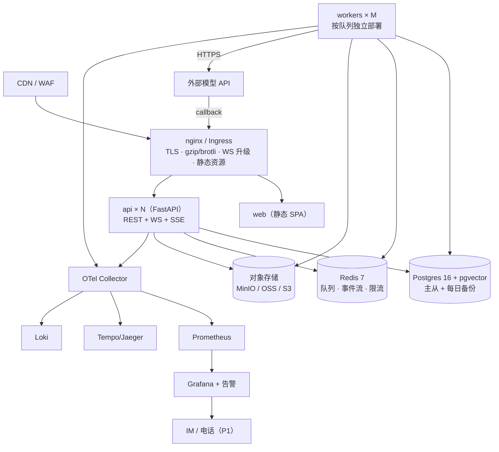

# 阶段 9：部署与监控
> 项目：AI 营销视频智能体（MVA）｜MVP：单机 Docker Compose；V1：K8s + 托管中间件

---

## 9.1 部署拓扑



| 环境 | 形态 | 说明 |
|---|---|---|
| dev | Docker Compose（`MODEL_MODE=mock`） | 无需外部 Key，`make up` 即用 |
| staging | Compose 或 K8s 单副本（`MODEL_MODE=live`，低配额） | 真实模型小流量验证 + 评测 |
| prod | K8s 多副本 + 托管 PG/Redis/对象存储 | 见 §9.3 |

---

## 9.2 生产 Compose（小规模上线 / 单机 ≤ 200 条/日）

```yaml
# docker-compose.prod.yml（节选）
x-logging: &log
  driver: json-file
  options: { max-size: "50m", max-file: "5" }

services:
  nginx:
    image: nginx:1.27-alpine
    volumes: ["./deploy/nginx.conf:/etc/nginx/nginx.conf:ro",
              "./apps/web/dist:/usr/share/nginx/html:ro"]
    ports: ["80:80", "443:443"]
    logging: *log
  api:
    image: registry/mva-api:${TAG}
    command: uvicorn app.main:app --host 0.0.0.0 --port 8000 --workers 2 --timeout-graceful-shutdown 30
    env_file: .env.prod
    deploy: { resources: { limits: { cpus: "2", memory: 2G }, reservations: { cpus: "0.5", memory: 768M } } }
    healthcheck: { test: ["CMD", "curl", "-f", "http://localhost:8000/healthz"], interval: 15s }
    restart: unless-stopped
    logging: *log
  worker-video:
    image: registry/mva-worker:${TAG}
    command: arq app.workers.main.WorkerSettings --queue mva:video
    env_file: .env.prod
    deploy: { replicas: 2, resources: { limits: { cpus: "2", memory: 2G } } }
    restart: unless-stopped
    logging: *log
  worker-general:
    image: registry/mva-worker:${TAG}
    command: arq app.workers.main.WorkerSettings --queue mva:image --queue mva:audio --queue mva:agent
    deploy: { replicas: 2 }
    logging: *log
  worker-render:
    image: registry/mva-worker:${TAG}
    command: arq app.workers.main.WorkerSettings --queue mva:render
    deploy: { replicas: 1, resources: { limits: { cpus: "4", memory: 4G } } }   # FFmpeg 吃 CPU
    logging: *log
  postgres: { image: pgvector/pgvector:pg16, volumes: ["pg:/var/lib/postgresql/data"], logging: *log }
  redis:    { image: redis:7-alpine, command: ["redis-server","--appendonly","yes","--maxmemory","2gb",
                                              "--maxmemory-policy","noeviction"], logging: *log }
  minio:    { image: minio/minio, command: server /data, volumes: ["minio:/data"], logging: *log }
  backup:
    image: registry/mva-tools:${TAG}
    command: sh -c "while true; do /scripts/backup.sh; sleep 86400; done"
    logging: *log
```

```nginx
# deploy/nginx.conf（关键片段）
map $http_upgrade $connection_upgrade { default upgrade; '' close; }
server {
  listen 443 ssl http2;
  client_max_body_size 512m;                 # 素材上传
  location /api/ { proxy_pass http://api:8000; proxy_read_timeout 300s; }
  location /ws/  { proxy_pass http://api:8000; proxy_http_version 1.1;
                   proxy_set_header Upgrade $http_upgrade;
                   proxy_set_header Connection $connection_upgrade;
                   proxy_read_timeout 3600s; }        # WS 长连接
  location /api/v1/agent/sessions/ { proxy_pass http://api:8000; proxy_buffering off; }  # SSE
  location / { root /usr/share/nginx/html; try_files $uri /index.html; }
}
```

---

## 9.3 K8s 清单（V1）

```
deploy/k8s/
├── namespace.yaml  configmap.yaml  secret.yaml（ExternalSecrets 同步）
├── api/{deployment.yaml, service.yaml, hpa.yaml, pdb.yaml}
├── worker/{video.yaml, image.yaml, audio.yaml, render.yaml, agent.yaml}   # 分队列部署
├── cron/{outbox.yaml, sweep.yaml, reconcile.yaml, backup.yaml, cleanup.yaml}
├── job/migrate.yaml（helm pre-install hook）
└── ingress.yaml
```

```yaml
# api/deployment.yaml
apiVersion: apps/v1
kind: Deployment
metadata: { name: mva-api, namespace: mva }
spec:
  replicas: 3
  strategy: { type: RollingUpdate, rollingUpdate: { maxSurge: 1, maxUnavailable: 0 } }
  selector: { matchLabels: { app: mva-api } }
  template:
    metadata:
      labels: { app: mva-api }
      annotations: { prometheus.io/scrape: "true", prometheus.io/port: "8000" }
    spec:
      terminationGracePeriodSeconds: 60
      containers:
        - name: api
          image: registry/mva-api:1.0.0
          ports: [{ containerPort: 8000 }]
          envFrom: [{ configMapRef: { name: mva-config } }, { secretRef: { name: mva-secrets } }]
          resources:
            requests: { cpu: 500m, memory: 768Mi }
            limits:   { cpu: "2",  memory: 2Gi }
          startupProbe:   { httpGet: { path: /healthz, port: 8000 }, failureThreshold: 30, periodSeconds: 2 }
          readinessProbe: { httpGet: { path: /readyz,  port: 8000 }, periodSeconds: 10 }
          livenessProbe:  { httpGet: { path: /healthz, port: 8000 }, periodSeconds: 20 }
          lifecycle:
            preStop: { exec: { command: ["sh","-c","sleep 8"] } }   # 等 Ingress 摘流量再退出
---
# api/hpa.yaml
apiVersion: autoscaling/v2
kind: HorizontalPodAutoscaler
metadata: { name: mva-api, namespace: mva }
spec:
  scaleTargetRef: { apiVersion: apps/v1, kind: Deployment, name: mva-api }
  minReplicas: 3
  maxReplicas: 20
  metrics:
    - type: Resource
      resource: { name: cpu, target: { type: Utilization, averageUtilization: 65 } }
    - type: Pods
      pods: { metric: { name: http_requests_per_second }, target: { type: AverageValue, averageValue: "40" } }
```

```yaml
# worker/video.yaml —— 队列长度驱动扩缩（KEDA）
apiVersion: keda.sh/v1alpha1
kind: ScaledObject
metadata: { name: mva-worker-video, namespace: mva }
spec:
  scaleTargetRef: { name: mva-worker-video }
  minReplicaCount: 1
  maxReplicaCount: 12
  cooldownPeriod: 300
  triggers:
    - type: redis-streams
      metadata:
        addressFrom: { secretKeyRef: { name: mva-secrets, key: redis-url } }
        stream: "arq:queue:mva:video"
        consumerGroup: mva
        lagCount: "30"          # 每 30 条积压加一个副本
---
# worker/deployment 关键点
spec:
  template:
    spec:
      terminationGracePeriodSeconds: 1800        # ⭐ 视频任务最长 30min，别被打断
      containers:
        - name: worker
          command: ["arq","app.workers.main.WorkerSettings","--queue","mva:video"]
          resources: { requests: { cpu: "1", memory: 1Gi }, limits: { cpu: "2", memory: 2Gi } }
          livenessProbe: { exec: { command: ["sh","-c","arq --check"] }, periodSeconds: 60 }
```
> **优雅退出**：worker 收到 SIGTERM 后停止取新任务、等待在途任务完成（最长 30min）；未完成任务由 `sweep_timeouts` cron 标记为 `failed(orphan)`，`resume` 时按 `input_hash` 复用已完成节点，不重复花钱。

**CronJob（对齐阶段 6）**
```yaml
jobs: [mva-outbox(每10s→用 Deployment+loop 实现), mva-sweep-timeouts(每1min),
       mva-reconcile-costs(每30min), mva-cleanup-expired(每日03:00), mva-backup(每日02:00)]
```

**资源与副本基线**
| 组件 | 副本 | requests | limits | 说明 |
|---|---|---|---|---|
| api | 3–20 | 500m/768Mi | 2/2Gi | HPA：CPU 65% 或 40 RPS/pod |
| worker-image | 2–10 | 500m/512Mi | 2/2Gi | 队列积压驱动 |
| worker-video | 1–12 | 1/1Gi | 2/2Gi | **长任务，宽 grace period** |
| worker-render | 1–4 | 2/2Gi | 4/4Gi | FFmpeg |
| worker-agent | 1–6 | 500m/768Mi | 1/2Gi | 单会话串行 |
| postgres | 托管 / 1主1从 | 2/4Gi | 4/8Gi | 连接池 PgBouncer |
| redis | 托管 / 1主1从 | 500m/1Gi | 1/2Gi | `noeviction`（队列数据不可淘汰） |

---

## 9.4 环境变量矩阵

| 变量 | api | worker | web | 默认 | 说明 |
|---|---|---|---|---|---|
| `DATABASE_URL` | ✅ | ✅ | — | — | `postgresql+asyncpg://…` |
| `DB_POOL_SIZE` / `DB_MAX_OVERFLOW` | ✅ | ✅ | — | 10 / 20 | 按副本数调，别打爆 PG 连接 |
| `REDIS_URL` | ✅ | ✅ | — | — | 队列 + 事件流 + 限流 |
| `S3_ENDPOINT/BUCKET/ACCESS_KEY/SECRET_KEY` | ✅ | ✅ | — | — | 产物与素材 |
| `SIGNED_URL_TTL_S` | ✅ | ✅ | — | 3600 | 预签名有效期 |
| `JWT_SECRET` / `JWT_TTL_MIN` | ✅ | — | — | — / 30 | |
| `MODEL_MODE` | ✅ | ✅ | — | `mock` | **mock / live** |
| `CALLBACK_BASE_URL` | ✅ | ✅ | — | — | 模型回调公网地址 |
| `ADAPTER_PRIORITY_{CAP}` | ✅ | ✅ | — | 见配置 | 例：`kling,jimeng_video`（厂商优先级链） |
| `MODEL_PRICES_JSON` | ✅ | ✅ | — | — | 价格表热更新（不写死代码） |
| `DEFAULT_BUDGET_CNY` | ✅ | — | — | 8.0 | 单条成片默认上限 |
| `MAX_RETRIES` | ✅ | ✅ | — | 3 | 重试上限 |
| `WORKER_CONCURRENCY_{QUEUE}` | — | ✅ | — | 见阶段 6 | 各队列并发 |
| `VITE_API_BASE` / `VITE_WS_BASE` | — | — | ✅ | — | 前端端点 |
| `VITE_USE_LOCAL_MOCK` | — | — | ✅ | false | 纯前端离线模式（E2E 用） |
| `OTEL_EXPORTER_OTLP_ENDPOINT` | ✅ | ✅ | ✅ | — | 追踪 |
| `LOG_LEVEL` / `LOG_SAMPLE_RATE` | ✅ | ✅ | — | info / 1.0 | |
| `POLICY_PROVIDER` / `POLICY_THRESHOLD` | ✅ | ✅ | — | 见配置 | 审核通道与阈值 |
| `FEATURE_AUTO_APPLY_PATCH` | ✅ | — | ✅ | false | Agent 低风险自动应用开关 |

---

## 9.5 日志规范

```jsonc
// 结构化 JSON（stdout，由采集器统一收）
{ "ts": "2026-01-01T10:00:00.123Z", "level": "info", "service": "worker-video",
  "trace_id": "tr_01H...", "span_id": "sp_...", "run_id": "run_...", "workflow_id": "wf_...",
  "node_id": "n_vid_1", "node_run_id": "nr_...", "attempt": 2,
  "event": "adapter.submit", "adapter": "kling", "model": "kling-v2",
  "duration_ms": 412, "cost_cny": 0.0, "msg": "提交视频任务", "extra": { "external_task_id": "kt_..." } }
```

| 规则 | 做法 |
|---|---|
| 必带字段 | `ts, level, service, trace_id, event`；涉及业务时带 `run_id/node_id` |
| 事件命名 | 点分小写：`adapter.submit` `adapter.callback` `node.start` `node.finish` `patch.applied` `budget.block` `policy.block` |
| 级别 | `debug`（仅 dev）/ `info`（状态变更）/ `warn`（可自愈异常、降级、预警）/ `error`（需人干预）/ `fatal`（进程级） |
| **脱敏** | `prompt` 正文、手机号、邮箱、身份证、鉴权头一律不进日志；prompt 只记 `prompt_hash` + `sha8` + 长度；日志中 URL 去掉签名参数 |
| 采样 | `info` 100%；高频循环日志（轮询）按 10:1 采样并升为 `debug` |
| 关联 | 前端每次请求带 `X-Trace-Id`，API 透传至 worker 与 adapter，全链路可串 |
| 保留 | app 日志 30 天（热 7 天）；`audit_log` 与 `cost_ledger` 永久（数据库）；产物按生命周期策略 |
| 用户可见日志 | `node_run.log_ref` 只暴露「节点级摘要」（不含 prompt 明文与内部错误栈），详细栈仅内部 |

---

## 9.6 指标与追踪

### 命名规范
`mva_{subsystem}_{metric}_{unit}`，统一 `_total/_seconds/_ratio/_count` 后缀。

| 子系统 | 指标 | 类型 | 标签 |
|---|---|---|---|
| api | `mva_api_requests_total` | counter | `route, method, status` |
| api | `mva_api_latency_seconds` | histogram | `route, method` |
| ws | `mva_ws_connections` | gauge | `workflow_shard` |
| ws | `mva_ws_reconnects_total` | counter | `reason` |
| run | `mva_runs_total` | counter | `mode, status` |
| run | `mva_run_duration_seconds` | histogram | `mode` |
| node | `mva_node_runs_total` | counter | `node_type, status` |
| node | `mva_node_latency_seconds` | histogram | `node_type, adapter` |
| node | `mva_node_retries_total` | counter | `node_type, error_class` |
| queue | `mva_queue_depth` | gauge | `queue` |
| queue | `mva_queue_wait_seconds` | histogram | `queue` |
| adapter | `mva_adapter_calls_total` | counter | `adapter, error_class` |
| adapter | `mva_adapter_circuit_open` | gauge | `adapter` |
| cost | `mva_cost_cny_total` | counter | `adapter, capability` |
| cost | `mva_budget_breach_total` | counter | `workflow_id`（**必须为 0**） |
| budget | `mva_budget_utilization` | gauge | `run_id` |
| policy | `mva_policy_blocks_total` | counter | `stage, category` |
| idem | `mva_idempotent_hits_total` | counter | `layer` |
| orphan | `mva_orphan_jobs` | gauge | —（**必须为 0**） |

### OTel Span 规范
```
http.request → run.drive → node.execute{node_type} → adapter.submit → adapter.poll → adapter.fetch
                                                    ↘ policy.check{stage}   ↘ qa.check{rule}
```
- 父子关系：`run.drive` 为 `node.execute` 的父；`node.execute` 为 `adapter.*` 与 `policy.check` 的父。
- Span 属性（必带）：`run_id, workflow_id, node_id, attempt, adapter, model, cost_cny`。
- Sampler：错误 100% 采样，正常 10%（高流量时可调）；Langfuse 独立记录 prompt 版本与输出（供评测，不用于线上排障）。

### Grafana 看板（6 块）
1. **业务总览**：成片数/日、成功率、P50/P95 时延、平均成本、预算触碰次数
2. **执行引擎**：队列深度与等待、并发数、节点成功/失败分布、重试率、孤儿任务
3. **模型适配**：各 adapter 调用量/错误分类/P95 时延/熔断状态/单位成本
4. **成本**：实时花费曲线、按模型/项目/日聚合、预算使用分布（Top N 超标预警）
5. **审核合规**：三层阻断量、阻断类别 Top、复核放行数
6. **Agent**：意图准确率趋势、schema 通过率、提案接受率、单会话成本、降级率

---

## 9.7 告警规则

```yaml
# deploy/prometheus/alerts.yaml
groups:
- name: mva-slo
  rules:
  - alert: ApiHighErrorRate
    expr: sum(rate(mva_api_requests_total{status=~"5.."}[5m])) / sum(rate(mva_api_requests_total[5m])) > 0.02
    for: 5m
    labels: { severity: warning }
    annotations: { summary: "API 5xx > 2%", runbook: "runbook.md#api-error" }
  - alert: ApiP95Slow
    expr: histogram_quantile(0.95, sum(rate(mva_api_latency_seconds_bucket[5m])) by (le)) > 0.8
    for: 10m
    labels: { severity: warning }
  - alert: RunSuccessRateLow
    expr: sum(rate(mva_runs_total{status="succeeded"}[1h])) / sum(rate(mva_runs_total[1h])) < 0.85
    for: 30m
    labels: { severity: critical }
    annotations: { summary: "成片成功率 <85%" }

- name: mva-cost
  rules:
  - alert: BudgetBreach            # 成本硬约束被突破 = P1，必须人工介入
    expr: increase(mva_budget_breach_total[10m]) > 0
    labels: { severity: critical }
    annotations: { summary: "出现预算突破，检查 BudgetGuard 与并发竞态" }
  - alert: CostSpikeAnomaly
    expr: sum(rate(mva_cost_cny_total[1h])) > 3 * avg_over_time(sum(rate(mva_cost_cny_total[1h]))[7d:1h])
    for: 15m
    labels: { severity: warning }
  - alert: ExpensiveRun
    expr: mva_run_cost_cny > 50
    labels: { severity: warning }
    annotations: { summary: "单条成片花费 >¥50，检查配比是否误升档" }

- name: mva-engine
  rules:
  - alert: VideoQueueBacklog
    expr: mva_queue_depth{queue="mva:video"} > 200
    for: 10m
    labels: { severity: warning }
  - alert: QueueWaitHigh
    expr: histogram_quantile(0.95, sum(rate(mva_queue_wait_seconds_bucket{queue="mva:video"}[10m])) by (le)) > 300
    for: 10m
    labels: { severity: warning }
  - alert: OrphanJobs
    expr: mva_orphan_jobs > 0
    for: 5m
    labels: { severity: warning }
  - alert: NodeFailureSpike
    expr: sum(rate(mva_node_runs_total{status="failed"}[15m])) / sum(rate(mva_node_runs_total[15m])) > 0.15
    for: 15m
    labels: { severity: critical }

- name: mva-adapters
  rules:
  - alert: AdapterDown
    expr: mva_adapter_circuit_open == 1
    for: 2m
    labels: { severity: critical }
    annotations: { summary: "适配器熔断，已启用降级链" }
  - alert: ContentBlockedSpike
    expr: increase(mva_policy_blocks_total[30m]) > 20
    labels: { severity: warning }
    annotations: { summary: "审核阻断激增，可能有人在批量尝试违规内容" }

- name: mva-infra
  rules:
  - alert: PostgresConnectionsHigh
    expr: pg_stat_activity_count / pg_settings_max_connections > 0.8
    for: 10m
    labels: { severity: warning }
  - alert: RedisMemoryHigh
    expr: redis_memory_used_bytes / redis_memory_max_bytes > 0.8
    for: 10m
    labels: { severity: warning }
  - alert: StorageLow
    expr: object_store_free_ratio < 0.15
    for: 30m
    labels: { severity: critical }
  - alert: BackupFailed
    expr: increase(mva_backup_failures_total[24h]) > 0
    labels: { severity: critical }
  - alert: CertExpiringSoon
    expr: probe_ssl_earliest_cert_expiry - time() < 14 * 86400
    labels: { severity: warning }
```

| 级别 | 通知渠道 | 响应 |
|---|---|---|
| critical | 电话 + IM + 值班 | 15min 内响应，1h 内缓解 |
| warning | IM | 4h 内响应 |
| info | 看板 only | 无需响应 |

---

## 9.8 SLO / SLI

| SLI | 目标（MVP） | 目标（V1） | 计量 |
|---|---|---|---|
| API 可用性（/runs 与 /workflows） | 99.5%/月 | 99.9%/月 | 非 5xx 请求占比 |
| 成片成功率（run succeeded） | ≥95% | ≥97% | 滑动 7 天 |
| 成片 P95 时延 | ≤20min | ≤15min | 端到端 |
| **预算突破次数** | **=0** | **=0** | 硬约束 |
| 内容合规漏放 | =0 | =0 | 抽检 + 用户举报 |
| 首次通过率 | ≥75% | ≥85% | 无人工返工 |

**错误预算策略**：月预算 = 0.5% × 总请求。预算耗尽 → 冻结新功能发布，只做稳定性修复。

---

## 9.9 成本优化

| 手段 | 预期收益 | 实现 |
|---|---|---|
| **镜头分级（Tiering）** | 成本 −60%~70% | 阶段 4 §4.4：默认 1×T-A + 2×T-B + 3×T-C |
| 产物/幂等缓存 | −15%~25% | `input_hash` 未变直接复用（同 seed/prompt 命中率实测 ~20%） |
| LLM 前缀缓存 | LLM 成本 −50% | L0 系统提示 + 节点目录稳定前缀（KV cache 命中） |
| Prompt 精简 + 结构化输出 | tokens −30% | 图摘要代替全图 JSON；few-shot 控制在 20 行 |
| 批量与合并 | −10% | 同 run 内多镜同模型合并请求（若适配器支持 batch） |
| 模型路由 | −20%~40% | 按预算/档位自动选 cheapest-satisfying（`quality_tier` 匹配） |
| 静帧动效替代 | −90%（该镜） | T-C：FFmpeg Ken Burns/视差，零模型成本 |
| 素材优先（T-D） | −100% | 用户上传素材质量达标即直接用 |
| 无人工确认才导出 | 减少返工 | 质检通过即导出，避免重复生成 |
| Worker 缩容到零 | 基础设施 −30% | KEDA 队列为空 → 缩到 1（保留 1 个保冷启动） |
| 对象存储生命周期 | 存储 −40% | 中间产物 7 天后转低频；30 天删；成片永久 |
| 视频转码复用 | CPU −50% | 同规格只转一次，产物按 `(resolution, crf, fps)` 复用 |
| Spot / 抢占实例 | 计算 −60% | render/worker 用可中断节点 + 断点续跑兜底 |

**成本看板三张**：①实时花费曲线（按分钟）②单位成本趋势（¥/条，按配比分组）③预算使用分布（Top N 项目与超标预警）。

---

## 9.10 容量规划

### 吞吐模型
```
单条成片占用资源（20s / 6 镜，默认配比）：
  video-seconds = 2×4s(T-A) + 2×4s(T-B) = 16 模型秒（并发占用 ≈ 段数 × 平均时长/并发度）
  image 调用    = 6 次（+20% 重试）
  LLM 调用      = 4 次
  render        = 1 次（≈30s CPU 单核）
  QA            = 12 次抽帧 VLM + 1 次 ASR

日产能（video 队列并发 C_v）：
  capacity ≈ C_v × 86400 × 0.7(利用率) / (segments_per_video × avg_segment_s / concurrency_per_task)
例：C_v = 6，segments=3，avg=60s（含等待），每条占用 3×60/3 = 60 "并发秒"
  → 6 × 86400 × 0.7 / 60 ≈ 6,048 条/日（理论上限）

现实修正（外部 RPM 限制是主瓶颈）：
  若 kling rpm=30、可用账号 2 个 → 日上限 ≈ 30×60×24×2 / (2 段/条) ≈ 43,200 段/日 → 14,400 条/日
  MVP 目标 200 条/日 → 只需 C_v=2~3，resource 需求极低
```

| 规模 | 条/日 | api 副本 | worker-video | render | PG | Redis |
|---|---|---|---|---|---|---|
| 试运行 | 50 | 1 | 1 | 1 | 2c4g | 1c1g |
| MVP 上线 | 200 | 2 | 2 | 1 | 4c8g | 2c2g |
| 增长期 | 1,000 | 4 | 4–6 | 2 | 8c16g + 只读 | 4c4g |
| 规模期 | 5,000 | 8–12 | 8–12 | 4 | 16c32g + PgBouncer | 集群 |

**扩容触发**：`queue_wait_p95 > 120s` 或 `queue_depth > 100` 持续 10min → 加 worker；`api cpu > 65%` 或 `rps/pod > 40` → 加 api。
**缩容保护**：`cooldownPeriod 300s` + `scaleDown stabilizationWindow 600s`，避免频繁抖动导致任务中断。

---

## 9.11 备份、灾备与数据保留

| 数据 | 策略 | RPO / RTO |
|---|---|---|
| Postgres | 每日全量 + WAL 归档（PITR）；备份异地存 | RPO 5min / RTO 1h |
| 对象存储 | 版本化 + 跨区复制（成片与素材） | RPO 0 / RTO 30min |
| Redis | AOF everysec；队列可丢（用 outbox 兜底重投） | RPO 1s / RTO 10min |
| 配置与密钥 | GitOps（SealedSecrets / ExternalSecrets） | — |
| 恢复演练 | 每季度一次全链路恢复演练（含 `resume` 续跑验证） | — |

**保留策略**：中间产物 7 天 → 低频；30 天删除（成片与账单永久）。`audit_log`、`cost_ledger`、`consent_record` 永久保留（合规要求）。
**删除请求（用户行使删除权）**：工作流归档 30 天后硬删；素材与产物同步删除；`audit_log` 保留但匿名化 `actor`。

---

## 9.12 安全加固清单

| 项 | 措施 |
|---|---|
| 传输 | 全站 HTTPS(HSTS)；WS 走 wss |
| 鉴权 | JWT 短期 + refresh；WS 连接 token 一次性校验；权限矩阵（阶段 6 §6.12） |
| 对象存储 | 桶私有；前端只用预签名 URL（TTL 1h）；禁止目录列举 |
| 上传 | MIME 嗅探 + 扩展名白名单 + 大小限（512MB）+ 病毒扫描（ClamAV 可选）+ 抽帧前用 FFmpeg 沙箱 |
| SSRF | 模型回调 URL 白名单；外部 URL 拉取仅允许 http(s) 且禁内网段 |
| 回调 | HMAC 签名 + 时间戳容差 300s + 去重键 |
| 密钥 | 全部走 K8s Secret / 云 KMS，不进镜像与仓库；`.env` 仅本地 |
| 依赖 | `pip-audit` / `npm audit` 进 CI；每月升级 |
| FFmpeg | 固定版本镜像；`-nostdin`；禁用外部协议（只读本地文件） |
| 限流 | 登录、上传、run 创建、Agent 消息分别限流（IP + 用户双维度） |
| 审计 | 所有写操作落 `audit_log`；审核放行需 admin + 双人复核（可配） |
| 合规 | 生成内容 AI 标识（元数据 + 平台声明 + 可选可见水印）；肖像/版权记录可追溯；未成年人相关词库拦截 |
| 隐私 | 日志脱敏（阶段 9 §9.5）；prompt 明文仅存于 `node_run.resolved_params`，可配置加密（KMS 信封加密） |

---

## 9.13 上线检查清单（Go-Live Checklist）

**功能与质量**
- [ ] 阶段 1 §8 的 10 条 DoD 全绿（E2E + 评测报告归档）
- [ ] 评测集 20 条 pass_rate ≥0.85；Agent intent_accuracy ≥0.93
- [ ] 冒烟：一句话 → 成片全链路（生产环境，真实模型，至少 3 个真实账号/品牌各 1 条）
- [ ] 预算闸门实测：故意把上限设 ¥1，确认阻断且实花 ≤¥1
- [ ] 三层审核实测：违规 prompt、违规素材、广告法禁用词各 1 例均阻断且 audit_log 落库

**可靠性**
- [ ] `resume` 断点续跑演练通过（kill worker → resume，花费不重复）
- [ ] 回调丢失演练（关掉回调 → 超时扫描兜底）
- [ ] adapter 熔断与降级链演练（把一个 adapter 打挂）
- [ ] 备份恢复演练：从备份恢复到新库并跑通一次成片
- [ ] 限流与配额上限确认（防刷：单用户并发 run ≤3）

**可观测**
- [ ] 6 张 Grafana 看板有数据；告警规则已加载且**演练过一次触发与恢复**
- [ ] `trace_id` 能从 API 请求串到 adapter 调用（抽 3 条验证）
- [ ] 日志脱敏抽查（确认无 prompt 明文、无手机号、无签名参数）

**运维**
- [ ] 环境变量矩阵核对（§9.4），密码轮换过一轮
- [ ] 部署回滚演练（`kubectl rollout undo` 或 compose 回退旧 tag）
- [ ] 值班表与 runbook 就位；告警通知渠道实测到达
- [ ] 成本告警与预算默认值按客户确认（默认 ¥8/条）
- [ ] 数据保留策略与删除流程确认（法务/合规签字）

---

## 9.14 运维手册（常见故障处置）

| 现象 | 可能原因 | 处置 |
|---|---|---|
| 成片成功率骤降 | 模型风控批量拒绝 / adapter 故障 | 看 `mva_adapter_calls_total{error_class}`；切换优先级链；通知用户重试 |
| 队列持续积压 | worker 副本不足 / RPM 被限 | 扩容 worker；检查 `rate_limited` 比例；临时降低默认 tier |
| 出现 `orphan_jobs` | worker 被 OOM/抢占杀死 | 确认 `sweep_timeouts` 生效；调大 memory limits；用 resume 续跑 |
| 预算突破告警 | 并发提交竞态 / 估价严重偏低 | 检查 `BudgetGuard` 是否在提交前与结算后双重校验；修正价格表 |
| WS 频繁重连 | Ingress 超时/心跳未配 | 检查 `proxy_read_timeout` 与 25s 心跳；确认 `since` 重放正常 |
| 前端图与后端不一致 | 有人绕过 patch 直改 DB | 检查 `version` 与 `graph_patch` 记录；前端重连全量同步 |
| 成片时长不对 | 时长配平被绕过 / TTS 时长偏差 | 复核 `balance_durations` 与 TTS `speed` 自适应 |
| 质检服务异常 | VLM 限流 | 降级为仅规则引擎，标 `qa_degraded` 并提示人工复核 |
| 用户投诉「AI 味重/不可用」 | tier 配比过低 / prompt 质量 | 看该 run 的 tier 分布；引导升档；推动 Skill 版本迭代（走评测门禁） |

---

## 9.15 全部阶段的产出索引

| 阶段 | 文档 | 核心产出 |
|---|---|---|
| 1 | `docs/phase-1-requirements.md` | 假设/旅程/用例/MVP范围/两模式统一模型/DoD |
| 2 | `docs/phase-2-architecture.md` | 六层架构/模块表/数据流/状态机/表设计/API/WS 协议 |
| 3 | `docs/phase-3-agent-design.md` | 主+5 子 Agent/Skill 规范/工具分级/JSON Schema/Prompt/熔断 |
| 4 | `docs/phase-4-video-pipeline.md` | 11 段流水线/镜头分级控本/一致性五层/质检阈值/适配器接口/成本时延 |
| 5 | `docs/phase-5-frontend-canvas.md` | 节点注册表/数据流/端口校验/前端执行/JSON Schema/WS/性能 |
| 6 | `docs/phase-6-backend-api-engine.md` | 三方合并算法/依赖计数调度/幂等与断点续跑/队列/回调/Hub |
| 7 | `docs/phase-7-code-skeleton.md` | monorepo 骨架/契约源/Mock 优先/端到端示例/W1–W4 计划 |
| 8 | `docs/phase-8-testing-evaluation.md` | 五层测试/属性测试/适配器套件/E2E 画布/三套评测集/成本回归 |
| 9 | `docs/phase-9-deploy-monitoring.md` | Compose/K8s/环境变量/日志追踪/告警/SLO/降本/容量/上线清单 |
